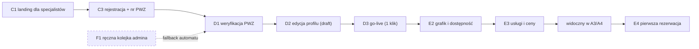

# E2E-3 — Specjalista: od landingu do 1. rezerwacji

## Notatki
- Wyjątek od konwencji: bez subgraph FE/BE — węzły to całe flowy (kompozycja ścieżki), nie kroki FE/BE.
- "D1 (F1)" z mapy: weryfikacja PWZ to automat (rejestr KRL/KIF); F1 = fallback do ręcznej kolejki admina (SLA 24 h robocze) — stąd przerywana krawędź i obrys.
- D2 ("stan w trakcie") biegnie równolegle do weryfikacji — pełna edycja draftu profilu jeszcze przed decyzją; kolejność na diagramie wg sekwencji z mapy.
- VIS = "widoczny w A3/A4" to efekt publikacji (sloty z E2 zasilają availability API listy wyników i profilu), nie osobny flow.
- E4 = pierwsza rezerwacja pojawia się w panelu specjalisty (lista/kalendarz).
- Diagramy składowe: [[c1-landing-dla-specjalistow]], [[c3-rejestracja]], [[d1-weryfikacja-pwz]], [[f1-kolejka-weryfikacji-pwz]], [[d2-stan-w-trakcie]], [[d3-go-live]], [[e2-grafik-dostepnosc]], [[e3-uslugi-ceny]], [[a3-lista-wynikow]], [[a4-profil-specjalisty]], [[e4-rezerwacje]]
