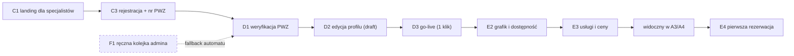

# E2E-3 — Specjalista: od landingu do 1. rezerwacji

## Notatki
- Wyjątek od konwencji: bez subgraph FE/BE — węzły to całe flowy (kompozycja ścieżki), nie kroki FE/BE.
- "D1 (F1)" z mapy: weryfikacja PWZ to automat (rejestr KRL/KIF); F1 = fallback do ręcznej kolejki admina (SLA 24 h robocze) — stąd przerywana krawędź i obrys.
- D2 ("stan w trakcie") biegnie równolegle do weryfikacji — pełna edycja draftu profilu jeszcze przed decyzją; kolejność na diagramie wg sekwencji z mapy.
- VIS = "widoczny w A3/A4" to efekt publikacji (sloty z E2 zasilają availability API listy wyników i profilu), nie osobny flow.
- E4 = pierwsza rezerwacja pojawia się w panelu specjalisty (lista/kalendarz).
- Diagramy składowe: [[c1-landing-dla-specjalistow]], [[c3-rejestracja]], [[d1-weryfikacja-pwz]], [[f1-kolejka-weryfikacji-pwz]], [[d2-stan-w-trakcie]], [[d3-go-live]], [[e2-grafik-dostepnosc]], [[e3-uslugi-ceny]], [[a3-lista-wynikow]], [[a4-profil-specjalisty]], [[e4-rezerwacje]]

## Co opisuje ten diagram

Droga specjalisty od pierwszego kontaktu z serwisem do pierwszej przyjętej rezerwacji: strona marketingowa, rejestracja z numerem PWZ, weryfikacja uprawnień (automatyczna, z ręcznym zapasem u admina), uzupełnienie profilu, publikacja jednym kliknięciem, a potem ustawienie grafiku i cennika — aż profil staje się widoczny dla pacjentów i wpada pierwsza rezerwacja. Uczestniczą specjalista, system weryfikujący oraz (w razie potrzeby) admin. Flow kończy się pierwszą rezerwacją widoczną w panelu specjalisty.

## Powiązane diagramy

| ID | Diagram | Jak się łączy |
|---|---|---|
| C1 | [c1-landing-dla-specjalistow.md](../cd-specjalista-onboarding/c1-landing-dla-specjalistow.md) | start ścieżki — landing marketingowy dla specjalistów |
| C3 | [c3-rejestracja.md](../cd-specjalista-onboarding/c3-rejestracja.md) | rejestracja konta z numerem PWZ |
| D1 | [d1-weryfikacja-pwz.md](../cd-specjalista-onboarding/d1-weryfikacja-pwz.md) | automatyczna weryfikacja PWZ w rejestrze KRL/KIF |
| F1 | [f1-kolejka-weryfikacji-pwz.md](../f-backoffice/f1-kolejka-weryfikacji-pwz.md) | ręczny fallback weryfikacji w kolejce admina (SLA 24 h robocze) |
| D2 | [d2-stan-w-trakcie.md](../cd-specjalista-onboarding/d2-stan-w-trakcie.md) | edycja draftu profilu równolegle do trwającej weryfikacji |
| D3 | [d3-go-live.md](../cd-specjalista-onboarding/d3-go-live.md) | publikacja profilu jednym kliknięciem |
| E2 | [e2-grafik-dostepnosc.md](../e-panel/e2-grafik-dostepnosc.md) | ustawiony grafik zasila pulę wolnych slotów |
| E3 | [e3-uslugi-ceny.md](../e-panel/e3-uslugi-ceny.md) | konfiguracja usług i cen widocznych dla pacjentów |
| A3 | [a3-lista-wynikow.md](../a-pacjent-public/a3-lista-wynikow.md) | opublikowany profil ze slotami pojawia się na liście wyników |
| A4 | [a4-profil-specjalisty.md](../a-pacjent-public/a4-profil-specjalisty.md) | publiczny profil z dostępnymi terminami do rezerwacji |
| E4 | [e4-rezerwacje.md](../e-panel/e4-rezerwacje.md) | pierwsza rezerwacja pojawia się w panelu specjalisty |

## Słownik

| Pojęcie | Wyjaśnienie |
|---|---|
| PWZ | Numer prawa wykonywania zawodu, potwierdzający uprawnienia specjalisty. |
| KRL/KIF | Rejestry zawodowe, w których system automatycznie sprawdza numer PWZ. |
| Fallback | Ścieżka zapasowa: gdy automat nie potwierdzi PWZ, weryfikację robi ręcznie admin. |
| SLA | Obiecany maksymalny czas ręcznej weryfikacji — 24 godziny robocze. |
| Draft | Robocza, niewidoczna publicznie wersja profilu, edytowana już w trakcie weryfikacji. |
| Go-live | Publikacja profilu jednym kliknięciem po pozytywnej weryfikacji. |
| Grafik / dostępność | Godziny pracy specjalisty, z których system wylicza wolne terminy do rezerwacji. |
| Availability API | Mechanizm serwujący wolne terminy na listę wyników i profil publiczny. |
| Slot | Pojedynczy wolny termin, który pacjent może zarezerwować. |
