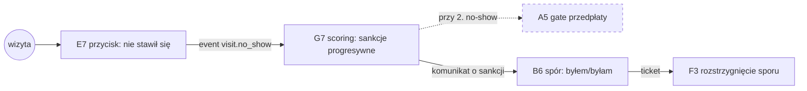

# E2E-4 — No-show, sankcja i spór

## Notatki
- Wyjątek od konwencji: bez subgraph FE/BE — węzły to całe flowy (kompozycja ścieżki), nie kroki FE/BE.
- "(2. raz: gate przedpłaty w A5)" z mapy = skutek warunkowy przy KOLEJNYM no-show tego pacjenta → przerywana krawędź i obrys; gate w checkoucie A5 (scoring gate: przedpłata lub akceptacja specjalisty).
- ⚠️ Flaga 2 dotyka gate'u: bez płatności online sankcja "wymóg przedpłaty" nie działa → fallback "rezerwacja za akceptacją specjalisty" (patrz [[a5-checkout-wariant-akceptacja]]).
- G4 auto-approval T+48 h musi być zablokowany przy oznaczonym no-show / otwartym sporze (Flaga 3, patrz [[g4-auto-approval]]).
- Wynik F3 (spór uznany/oddalony) wpływa na scoring G7 — mapa nie rozpisuje kierunku powrotnego, więc nie rysuję krawędzi zwrotnej (założenie minimalne).
- Diagramy składowe: [[e7-no-show]], [[g7-scoring-engine]], [[a5-checkout]], [[a5-checkout-wariant-przedplata]], [[b6-spor-no-show]], [[f3-spory]]

## Co opisuje ten diagram

Ścieżka konfliktowa: pacjent nie pojawia się na wizycie, specjalista oznacza nieobecność, a system automatycznie nalicza sankcje — przy drugiej nieobecności kolejne rezerwacje tego pacjenta wymagają przedpłaty lub akceptacji specjalisty. Pacjent może zakwestionować oznaczenie i otworzyć spór, który rozstrzyga admin. Uczestniczą specjalista (oznacza no-show), system (scoring i sankcje), pacjent (spór) oraz admin (werdykt). Flow zaczyna się od nieodbytej wizyty, a kończy rozstrzygnięciem sporu.

## Powiązane diagramy

| ID | Diagram | Jak się łączy |
|---|---|---|
| E7 | [e7-no-show.md](../e-panel/e7-no-show.md) | specjalista oznacza nieobecność pacjenta — start ścieżki |
| G7 | [g7-scoring-engine.md](../g-silniki/g7-scoring-engine.md) | event visit.no_show uruchamia sankcje progresywne |
| A5 | [a5-checkout.md](../a-pacjent-public/a5-checkout.md) | przy 2. no-show checkout pacjenta dostaje scoring gate |
| A5 (wariant przedpłaty) | [a5-checkout-wariant-przedplata.md](../a-pacjent-public/a5-checkout-wariant-przedplata.md) | gate przedpłaty — sankcja w wariancie z płatnościami online |
| A5 (wariant akceptacji) | [a5-checkout-wariant-akceptacja.md](../a-pacjent-public/a5-checkout-wariant-akceptacja.md) | fallback gate'u, gdy płatności online są wyłączone (Flaga 2) |
| B6 | [b6-spor-no-show.md](../b-pacjent-konto/b6-spor-no-show.md) | pacjent kwestionuje oznaczenie no-show ("byłem/byłam") |
| F3 | [f3-spory.md](../f-backoffice/f3-spory.md) | admin rozstrzyga ticket sporu (uznany/oddalony) |
| G4 | [g4-auto-approval.md](../g-silniki/g4-auto-approval.md) | auto-approval T+48 h zablokowany przy no-show lub otwartym sporze (Flaga 3) |

## Słownik

| Pojęcie | Wyjaśnienie |
|---|---|
| No-show | Nieobecność pacjenta na umówionej wizycie bez wcześniejszego odwołania. |
| visit.no_show | Zdarzenie systemowe emitowane po oznaczeniu nieobecności — uruchamia sankcje. |
| Scoring | Punktowa ocena wiarygodności pacjenta budowana z historii nieobecności i późnych odwołań. |
| Sankcje progresywne | Kary rosnące z każdym przewinieniem — od komunikatu po wymóg przedpłaty. |
| Gate przedpłaty | Wymóg zapłaty z góry przy kolejnych rezerwacjach pacjenta z historią no-show. |
| Flaga 2 | Otwarta decyzja o płatnościach online; bez nich sankcją jest akceptacja specjalisty zamiast przedpłaty. |
| Flaga 3 | Reguła blokująca automatyczne zatwierdzenie wizyty (G4), gdy jest oznaczony no-show lub otwarty spór. |
| Spór / ticket | Zgłoszenie pacjenta "byłem na wizycie", które trafia do rozstrzygnięcia przez admina. |
| Auto-approval | Automatyczne uznanie wizyty za odbytą po 48 godzinach — w tej ścieżce celowo wstrzymywane. |
