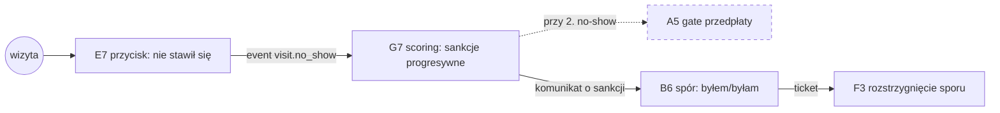

# E2E-4 — No-show, sankcja i spór

## Notatki
- Wyjątek od konwencji: bez subgraph FE/BE — węzły to całe flowy (kompozycja ścieżki), nie kroki FE/BE.
- "(2. raz: gate przedpłaty w A5)" z mapy = skutek warunkowy przy KOLEJNYM no-show tego pacjenta → przerywana krawędź i obrys; gate w checkoucie A5 (scoring gate: przedpłata lub akceptacja specjalisty).
- ⚠️ Flaga 2 dotyka gate'u: bez płatności online sankcja "wymóg przedpłaty" nie działa → fallback "rezerwacja za akceptacją specjalisty" (patrz [[a5-checkout-wariant-akceptacja]]).
- G4 auto-approval T+48 h musi być zablokowany przy oznaczonym no-show / otwartym sporze (Flaga 3, patrz [[g4-auto-approval]]).
- Wynik F3 (spór uznany/oddalony) wpływa na scoring G7 — mapa nie rozpisuje kierunku powrotnego, więc nie rysuję krawędzi zwrotnej (założenie minimalne).
- Diagramy składowe: [[e7-no-show]], [[g7-scoring-engine]], [[a5-checkout]], [[a5-checkout-wariant-przedplata]], [[b6-spor-no-show]], [[f3-spory]]
