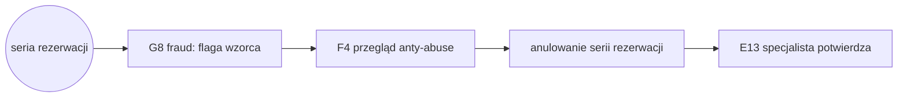

# E2E-5 — Sabotaż slotów (blokowanie kalendarza)

## Notatki
- Wyjątek od konwencji: bez subgraph FE/BE — węzły to całe flowy (kompozycja ścieżki), nie kroki FE/BE.
- "seria rezerwacji" = zdarzenie startowe (podejrzany wzorzec: multikonta, limity per numer/IP/device), nie ID flowu.
- G8 (fraud detection, P1) flaguje wzorzec → kolejka F4; w P0 min. wykrycie jest ręczne (zgłoszenie E13 "podejrzewam blokowanie kalendarza" tworzy ticket do F4) — na diagramie ścieżka wg sekwencji z mapy (G8 przed F4).
- "anulowanie serii" = akcja admina z F4 (blokady + anulowanie serii), nie osobny flow.
- E13 na końcu ścieżki: specjalista potwierdza rozwiązanie zgłoszenia; sloty wracają do puli dostępności (E2 → A3/A4).
- Diagramy składowe: [[f4-anty-abuse]], [[e13-zgloszenie-abuse]]
- Brak pliku diagramu dla: G8 (fraud detection) — odwołanie tylko po ID.

## Co opisuje ten diagram

Ścieżka obrony przed sabotażem: ktoś (np. nieuczciwa konkurencja) masowo rezerwuje terminy specjalisty, żeby zablokować mu kalendarz. System wykrywania nadużyć flaguje podejrzany wzorzec, admin przegląda sprawę i anuluje serię fikcyjnych rezerwacji, a specjalista potwierdza rozwiązanie zgłoszenia — jego terminy wracają do sprzedaży. Uczestniczą system (automatyczna detekcja), admin (decyzja i anulowanie) oraz specjalista (zgłoszenie/potwierdzenie). Flow zaczyna się od podejrzanej serii rezerwacji, a kończy odblokowaniem kalendarza.

## Powiązane diagramy

| ID | Diagram | Jak się łączy |
|---|---|---|
| G8 | [00-katalog-eventow.md](../00-core/00-katalog-eventow.md) | fraud detection flaguje podejrzany wzorzec serii rezerwacji |
| F4 | [f4-anty-abuse.md](../f-backoffice/f4-anty-abuse.md) | admin przegląda flagę, blokuje sprawcę i anuluje serię |
| E13 | [e13-zgloszenie-abuse.md](../e-panel/e13-zgloszenie-abuse.md) | specjalista zgłasza blokowanie kalendarza i potwierdza rozwiązanie |
| E2 | [e2-grafik-dostepnosc.md](../e-panel/e2-grafik-dostepnosc.md) | odblokowane sloty wracają do grafiku i puli dostępności |
| A3 | [a3-lista-wynikow.md](../a-pacjent-public/a3-lista-wynikow.md) | uwolnione terminy znów widoczne na liście wyników |
| A4 | [a4-profil-specjalisty.md](../a-pacjent-public/a4-profil-specjalisty.md) | uwolnione terminy znów widoczne na profilu specjalisty |

## Słownik

| Pojęcie | Wyjaśnienie |
|---|---|
| Sabotaż slotów | Celowe blokowanie kalendarza specjalisty fikcyjnymi rezerwacjami. |
| Multikonto | Wiele kont zakładanych przez tę samą osobę, żeby ominąć limity rezerwacji. |
| Fraud detection | Automatyczne wykrywanie podejrzanych wzorców rezerwacji (silnik G8). |
| Flaga | Oznaczenie podejrzanego przypadku, które trafia do przeglądu przez admina. |
| Limity per numer/IP/device | Ograniczenia liczby rezerwacji z jednego telefonu, adresu sieciowego lub urządzenia. |
| Anulowanie serii | Hurtowe cofnięcie fikcyjnych rezerwacji przez admina wraz z blokadą sprawcy. |
| Ticket | Zgłoszenie sprawy do kolejki administratora. |
| Pula dostępności | Zbiór wolnych terminów widocznych dla pacjentów — anulowane sloty do niej wracają. |
| P0 / P1 | Priorytety wdrożenia: w wersji minimalnej (P0) wykrywanie jest ręczne, automat G8 dochodzi później (P1). |
