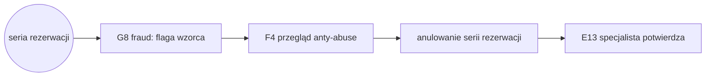

# E2E-5 — Sabotaż slotów (blokowanie kalendarza)

## Notatki
- Wyjątek od konwencji: bez subgraph FE/BE — węzły to całe flowy (kompozycja ścieżki), nie kroki FE/BE.
- "seria rezerwacji" = zdarzenie startowe (podejrzany wzorzec: multikonta, limity per numer/IP/device), nie ID flowu.
- G8 (fraud detection, P1) flaguje wzorzec → kolejka F4; w P0 min. wykrycie jest ręczne (zgłoszenie E13 "podejrzewam blokowanie kalendarza" tworzy ticket do F4) — na diagramie ścieżka wg sekwencji z mapy (G8 przed F4).
- "anulowanie serii" = akcja admina z F4 (blokady + anulowanie serii), nie osobny flow.
- E13 na końcu ścieżki: specjalista potwierdza rozwiązanie zgłoszenia; sloty wracają do puli dostępności (E2 → A3/A4).
- Diagramy składowe: [[f4-anty-abuse]], [[e13-zgloszenie-abuse]]
- Brak pliku diagramu dla: G8 (fraud detection) — odwołanie tylko po ID.
