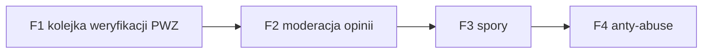

# E2E-6 — Dzień admina (Back Office)

## Notatki
- Wyjątek od konwencji: bez subgraph FE/BE — węzły to całe flowy (kompozycja ścieżki), nie kroki FE/BE.
- Ścieżka = kolejność obchodu kolejek Back Office w ciągu dnia (jeden admin, multi-wertykal, filtr per serwis — F9).
- Priorytet F1: SLA "do 24 h roboczych" na weryfikację PWZ — dlatego pierwsza w obchodzie.
- F3 (spory) formalnie P1; F4 w P0 min. = ręczna blokada.
- Każda akcja admina trafia do audit logu F10 (dane zdrowotne!), patrz [[f10-audit-log]].
- Diagramy składowe: [[f1-kolejka-weryfikacji-pwz]], [[f2-moderacja-opinii]], [[f3-spory]], [[f4-anty-abuse]]
