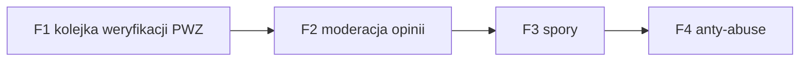

# E2E-6 — Dzień admina (Back Office)

## Notatki
- Wyjątek od konwencji: bez subgraph FE/BE — węzły to całe flowy (kompozycja ścieżki), nie kroki FE/BE.
- Ścieżka = kolejność obchodu kolejek Back Office w ciągu dnia (jeden admin, multi-wertykal, filtr per serwis — F9).
- Priorytet F1: SLA "do 24 h roboczych" na weryfikację PWZ — dlatego pierwsza w obchodzie.
- F3 (spory) formalnie P1; F4 w P0 min. = ręczna blokada.
- Każda akcja admina trafia do audit logu F10 (dane zdrowotne!), patrz [[f10-audit-log]].
- Diagramy składowe: [[f1-kolejka-weryfikacji-pwz]], [[f2-moderacja-opinii]], [[f3-spory]], [[f4-anty-abuse]]

## Co opisuje ten diagram

Dzień pracy administratora serwisu: kolejność, w jakiej jeden admin obchodzi cztery kolejki Back Office — najpierw weryfikacje numerów PWZ (bo obowiązuje limit czasu na odpowiedź), potem moderację opinii, spory o nieobecności i na końcu przegląd nadużyć. Uczestniczy wyłącznie admin, ale jego decyzje bezpośrednio dotykają specjalistów i pacjentów. Każda wykonana akcja jest trwale zapisywana w dzienniku audytu, ponieważ system przetwarza dane zdrowotne.

## Powiązane diagramy

| ID | Diagram | Jak się łączy |
|---|---|---|
| F1 | [f1-kolejka-weryfikacji-pwz.md](../f-backoffice/f1-kolejka-weryfikacji-pwz.md) | pierwsza kolejka obchodu — weryfikacja PWZ z SLA do 24 h roboczych |
| F2 | [f2-moderacja-opinii.md](../f-backoffice/f2-moderacja-opinii.md) | druga kolejka — moderacja opinii przed publikacją |
| F3 | [f3-spory.md](../f-backoffice/f3-spory.md) | trzecia kolejka — rozstrzyganie sporów o no-show |
| F4 | [f4-anty-abuse.md](../f-backoffice/f4-anty-abuse.md) | czwarta kolejka — przegląd flag i zgłoszeń nadużyć |
| F9 | [f9-rbac-wertykale.md](../f-backoffice/f9-rbac-wertykale.md) | filtr per serwis/wertykal określa, które sprawy admin widzi |
| F10 | [f10-audit-log.md](../f-backoffice/f10-audit-log.md) | każda akcja admina jest zapisywana w audit logu |

## Słownik

| Pojęcie | Wyjaśnienie |
|---|---|
| Back Office | Wewnętrzny panel administracyjny serwisu, niewidoczny dla pacjentów i specjalistów. |
| Kolejka | Lista spraw czekających na decyzję admina, obsługiwana po kolei. |
| PWZ | Numer prawa wykonywania zawodu, weryfikowany przed dopuszczeniem specjalisty do serwisu. |
| SLA | Obiecany maksymalny czas obsługi — dla weryfikacji PWZ do 24 godzin roboczych. |
| Moderacja | Sprawdzanie treści opinii przed ich publikacją na profilach. |
| Spór | Sprawa, w której pacjent kwestionuje oznaczenie nieobecności — admin wydaje werdykt. |
| Anty-abuse | Przegląd zgłoszeń i automatycznych flag dotyczących nadużyć (np. blokowania kalendarza). |
| Wertykal | Odrębna branżowa odsłona serwisu (np. logopedzi) — admin filtruje sprawy per serwis. |
| RBAC | System ról i uprawnień decydujący, co dany admin widzi i jakie akcje może wykonać. |
| Audit log | Trwały zapis każdej akcji admina, wymagany przy przetwarzaniu danych zdrowotnych. |
