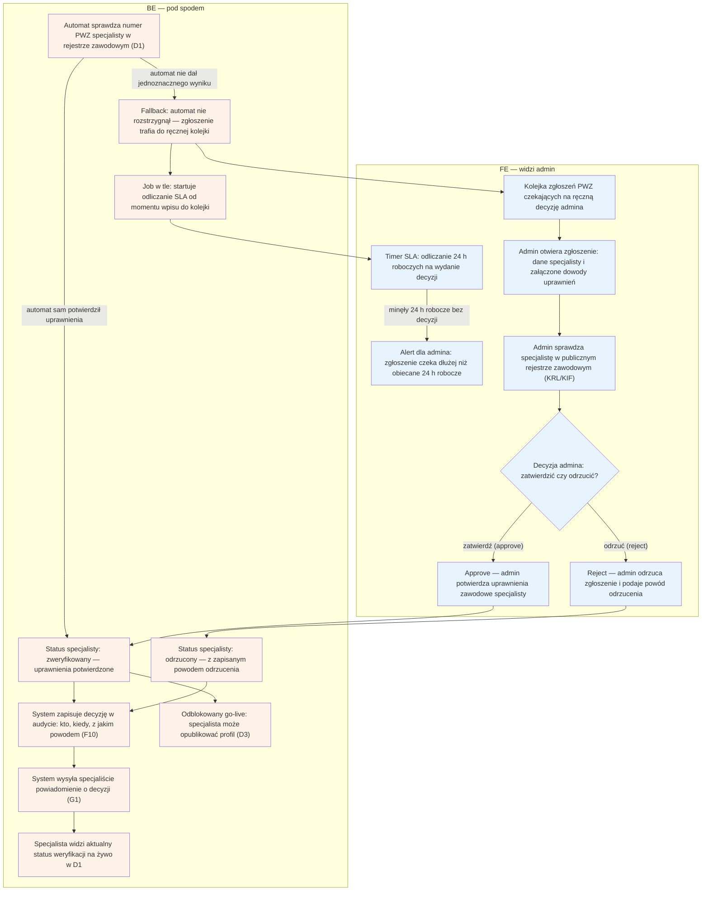

# F1 — Kolejka weryfikacji PWZ

## Notatki
- Priorytet: P0. SLA: 24 h robocze — obietnica z [[d1-weryfikacja-pwz]] (D1: „status na żywo + SLA do 24 h roboczych"); timer SLA startuje przy wpisie do kolejki, przekroczenie = alert dla admina.
- Kolejka zasilana wyłącznie fallbackiem automatu D1 (rejestr KRL/KIF/wet.) — gdy automat rozstrzyga sam, F1 jest pomijane.
- Reject zawsze z powodem — powód trafia do specjalisty (G1) i do widoku statusu w D1.
- Approve odblokowuje go-live 1 klikiem → [[d3-go-live]] (D3).
- Każda decyzja zapisywana w audycie F10 (kto, kiedy, jaki powód).
- Założenie minimalne: mapa nie przewiduje ścieżki „poproś o uzupełnienie dowodów" — nie dodano (byłby to krok spoza mapy); jeśli potrzebna, to decyzja do S3/#5.
- Powiązania: D1, D3, F10, G1, prompt #5 (research weryfikacji).

## Co opisuje ten diagram
Diagram pokazuje, jak admin obsługuje kolejkę ręcznej weryfikacji uprawnień zawodowych (PWZ) specjalistów. Trafiają tu wyłącznie zgłoszenia, których nie rozstrzygnął automat sprawdzający rejestry zawodowe (D1). Admin ogląda dane i dowody, zagląda do rejestru i podejmuje decyzję approve/reject, pilnując limitu 24 h roboczych (SLA). Pozytywna decyzja odblokowuje specjaliście publikację profilu (go-live), a negatywna wraca do niego z powodem odrzucenia.

## Aktorzy w tym flow

| Rola | Kto to jest | Co robi w tym flow |
|---|---|---|
| **Admin** (operator platformy) | zespół prowadzący serwis — back office; główny użytkownik tego flow | przegląda kolejkę zgłoszeń, ogląda dane i dowody specjalisty, sprawdza rejestr zawodowy i wydaje decyzję approve/reject w limicie 24 h roboczych |
| **Specjalista** (logopeda / lekarz) | usługodawca, który chce przyjmować rezerwacje na platformie | jest podmiotem weryfikacji: dostarczył numer PWZ i dowody, dostaje powiadomienie o decyzji, widzi status na żywo w D1, a po approve może opublikować profil (D3) |
| **System / Backend** | automaty platformy działające bez udziału człowieka | automat próbuje sam potwierdzić numer PWZ w rejestrze (D1), zapisuje decyzje w audycie (F10) i aktualizuje status specjalisty |
| **Joby / Kolejka** | zadania uruchamiane w tle oraz lista spraw czekających na obsługę | kolejka przechowuje zgłoszenia, których nie rozstrzygnął automat; job odlicza SLA i podnosi alert po przekroczeniu 24 h roboczych |
| **SMS/Email** | kanał powiadomień platformy (notification engine, G1) | dostarcza specjaliście wiadomość o wyniku weryfikacji (approve albo reject z powodem) |
| **Rejestr PWZ** (KRL/KIF) | zewnętrzny, publiczny rejestr zawodowy prowadzony poza platformą | źródło prawdy o uprawnieniach: automat odpytuje go w D1, a admin zagląda do niego ręcznie przed decyzją |
| **FE** | panel administracyjny w przeglądarce — to, co admin widzi na ekranie | pokazuje kolejkę, szczegóły zgłoszenia, podgląd rejestru, timer SLA, alerty i przyciski decyzji |

## Objaśnienie bloków

| Blok | Co to znaczy w praktyce | Kto tu działa |
|---|---|---|
| Automat sprawdza numer PWZ (D1) | Zanim ktokolwiek z zespołu ruszy palcem, system sam próbuje sprawdzić w publicznym rejestrze zawodowym, czy podany przez specjalistę numer PWZ (prawo wykonywania zawodu) jest ważny. Jeśli automat znajdzie jednoznaczne potwierdzenie — cała ręczna część tego flow jest pomijana. | System, Rejestr PWZ |
| Fallback: zgłoszenie trafia do ręcznej kolejki | Ścieżka awaryjna: automat nie potrafił jednoznacznie potwierdzić uprawnień (np. literówka w numerze, brak wpisu w rejestrze, niejednoznaczne dane). Sprawę przejmuje człowiek — zgłoszenie zostaje dopisane do kolejki admina. | System |
| Kolejka zgłoszeń PWZ | Lista spraw czekających na ręczną decyzję — każda pozycja to jeden specjalista, którego uprawnień automat nie potwierdził. Admin obsługuje je po kolei. | Admin |
| Job w tle: startuje odliczanie SLA | W momencie wpisu do kolejki system uruchamia zegar. SLA to obietnica maksymalnego czasu obsługi — tutaj 24 godziny robocze na wydanie decyzji (obietnica składana specjaliście w D1). | System (job) |
| Timer SLA: odliczanie 24 h roboczych | Widoczny dla admina licznik pokazujący, ile czasu zostało na decyzję w danej sprawie, zanim platforma złamie obietnicę 24 h roboczych. | Admin (obserwuje), System (odlicza) |
| Alert: zgłoszenie czeka dłużej niż 24 h robocze | Jeśli decyzja nie zapadła w obiecanym czasie, system podnosi ostrzeżenie — sprawa jest przeterminowana i wymaga natychmiastowej obsługi. | System (alarmuje), Admin (reaguje) |
| Admin otwiera zgłoszenie: dane i dowody | Admin ogląda komplet informacji: dane specjalisty (imię, nazwisko, zawód, numer PWZ) oraz załączone dowody uprawnień (np. skan dokumentu). | Admin |
| Admin sprawdza rejestr zawodowy (KRL/KIF) | Admin ręcznie zagląda do publicznego rejestru zawodowego (np. Krajowy Rejestr Lekarzy, Krajowa Izba Fizjoterapeutów), żeby porównać dane zgłoszenia z oficjalnym wpisem. | Admin, Rejestr PWZ |
| Decyzja admina: zatwierdzić czy odrzucić? | Moment rozstrzygnięcia — na podstawie dowodów i rejestru admin wybiera jedną z dwóch opcji: approve albo reject. | Admin |
| Approve — potwierdzenie uprawnień | „Approve" = zatwierdzenie: admin uznaje, że specjalista naprawdę ma ważne uprawnienia zawodowe. To pozytywne zakończenie weryfikacji. | Admin |
| Reject — odrzucenie z powodem | „Reject" = odrzucenie: admin uznaje zgłoszenie za niewystarczające lub nieprawdziwe i obowiązkowo podaje powód — specjalista musi wiedzieć, co poszło nie tak. | Admin |
| Status specjalisty: zweryfikowany | System zapisuje na koncie specjalisty, że uprawnienia zostały potwierdzone (przez automat albo przez admina). | System |
| Status specjalisty: odrzucony | System zapisuje odrzucenie razem z powodem — specjalista zobaczy go w swoim panelu. | System |
| System zapisuje decyzję w audycie (F10) | Każda decyzja (pozytywna i negatywna) trafia do trwałego rejestru audytowego: kto ją podjął, kiedy i z jakim powodem. To zabezpieczenie na wypadek reklamacji lub kontroli. | System |
| System wysyła powiadomienie o decyzji (G1) | Specjalista dostaje wiadomość (e-mail/SMS) z wynikiem weryfikacji — przy odrzuceniu razem z powodem. | System, SMS/Email |
| Specjalista widzi status na żywo w D1 | W swoim panelu onboardingowym (D1) specjalista przez cały czas widzi aktualny etap weryfikacji — bez dzwonienia i dopytywania. | Specjalista |
| Odblokowany go-live (D3) | Po approve specjalista może jednym kliknięciem opublikować profil — od tego momentu jest widoczny publicznie i przyjmuje rezerwacje (flow D3). | Specjalista, System |

## Powiązane diagramy
| ID | Diagram | Jak się łączy |
|---|---|---|
| D1 | [d1-weryfikacja-pwz.md](../cd-specjalista-onboarding/d1-weryfikacja-pwz.md) | automat D1 zasila kolejkę fallbackiem, a specjalista widzi tam status na żywo |
| D3 | [d3-go-live.md](../cd-specjalista-onboarding/d3-go-live.md) | approve odblokowuje go-live profilu specjalisty |
| F10 | [f10-audit-log.md](f10-audit-log.md) | każda decyzja admina zapisywana w audycie |
| G1 | [00-katalog-eventow.md](../00-core/00-katalog-eventow.md) | powiadomienie specjalisty o decyzji przez notification engine |

## Słownik
| Pojęcie | Wyjaśnienie |
|---|---|
| PWZ | Prawo wykonywania zawodu — numer potwierdzający uprawnienia specjalisty do pracy w zawodzie. |
| SLA | Obiecany maksymalny czas obsługi zgłoszenia — tutaj 24 godziny robocze. |
| Kolejka weryfikacji | Lista zgłoszeń czekających na ręczną decyzję admina. |
| Rejestr KRL/KIF | Publiczny rejestr zawodowy, w którym można sprawdzić, czy specjalista ma ważne uprawnienia. |
| Fallback | Ścieżka awaryjna: gdy automat nie potrafi rozstrzygnąć sprawy, przejmuje ją człowiek. |
| Approve / Reject | Decyzja admina: zatwierdzenie zgłoszenia albo odrzucenie z podanym powodem. |
| Go-live | Moment, w którym profil specjalisty staje się publicznie widoczny i przyjmuje rezerwacje. |
| Audyt (audit log) | Trwały zapis tego, kto podjął jaką decyzję, kiedy i z jakim powodem. |
| Job (zadanie w tle) | Automatyczny proces uruchamiany przez system bez udziału człowieka — tutaj odlicza czas SLA dla każdego zgłoszenia w kolejce. |
| Alert SLA | Ostrzeżenie wyświetlane adminowi, gdy zgłoszenie czeka na decyzję dłużej niż obiecane 24 h robocze. |
| Notification engine (G1) | Wspólny mechanizm platformy wysyłający powiadomienia SMS/e-mail — tutaj informuje specjalistę o wyniku weryfikacji. |
| Status na żywo | Bieżący stan weryfikacji widoczny dla specjalisty w jego panelu (D1) — aktualizuje się automatycznie po decyzji admina. |
| Zgłoszenie | Komplet danych specjalisty czekający na weryfikację: dane osobowe, numer PWZ i załączone dowody uprawnień. |
