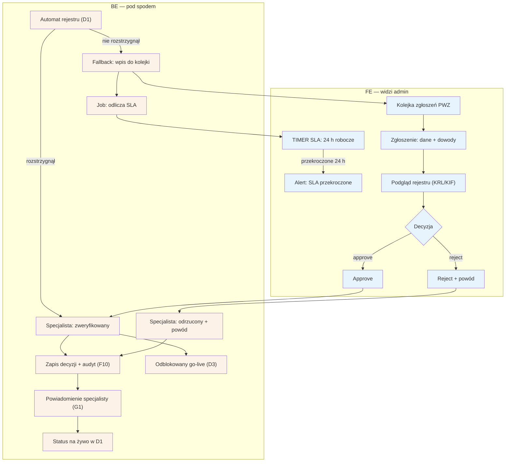

# F1 — Kolejka weryfikacji PWZ

## Notatki
- Priorytet: P0. SLA: 24 h robocze — obietnica z [[d1-weryfikacja-pwz]] (D1: „status na żywo + SLA do 24 h roboczych"); timer SLA startuje przy wpisie do kolejki, przekroczenie = alert dla admina.
- Kolejka zasilana wyłącznie fallbackiem automatu D1 (rejestr KRL/KIF/wet.) — gdy automat rozstrzyga sam, F1 jest pomijane.
- Reject zawsze z powodem — powód trafia do specjalisty (G1) i do widoku statusu w D1.
- Approve odblokowuje go-live 1 klikiem → [[d3-go-live]] (D3).
- Każda decyzja zapisywana w audycie F10 (kto, kiedy, jaki powód).
- Założenie minimalne: mapa nie przewiduje ścieżki „poproś o uzupełnienie dowodów" — nie dodano (byłby to krok spoza mapy); jeśli potrzebna, to decyzja do S3/#5.
- Powiązania: D1, D3, F10, G1, prompt #5 (research weryfikacji).
