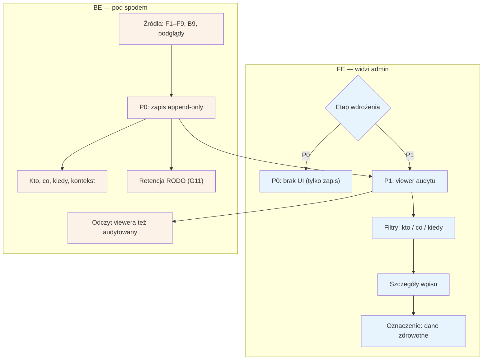

# F10 — Audit log

## Notatki
- Priorytet: P0 zapis → P1 viewer (wprost z mapy). W P0 nie ma UI — dostęp do logu np. bezpośrednio w bazie (S3: „co w P0 może być SQL-em").
- Zakres zapisu: kto co WIDZIAŁ i kto co ZMIENIŁ — dane zdrowotne pacjentów wymagają logowania samych odczytów (kluczowy konsument: podgląd konta w [[f5-uzytkownicy]] F5).
- Źródła wpisów: decyzje F1–F4, podglądy i akcje F5, billing F6, zmiany treści F7, konfiguracji F8, ról F9 oraz wnioski RODO z B9.
- Log append-only (bez edycji/usuwania wpisów przez adminów) — założenie minimalne, mapa nie precyzuje; retencja wpisów wg jobów RODO G11.
- Odczyt logu przez viewer sam też jest audytowany (założenie minimalne — spójność z zasadą „każdy dostęp do danych logowany").
- Powiązania: F1–F9 (źródła), B9, G11, S3 pkt 3.

## Co opisuje ten diagram
Diagram pokazuje centralny dziennik audytowy Back Office'u. System dopisuje (bez możliwości edycji i usuwania — append-only) wpis o każdej akcji i każdym podglądzie danych z modułów F1–F9 oraz o wnioskach RODO: kto, co, kiedy i w jakim kontekście. Na starcie (etap P0) istnieje sam zapis bez interfejsu; docelowo (etap P1) admin przegląda log w viewerze z filtrami, przy czym samo przeglądanie logu również jest audytowane. Czas przechowywania wpisów wyznaczają joby RODO.

## Powiązane diagramy
| ID | Diagram | Jak się łączy |
|---|---|---|
| F1 | [f1-kolejka-weryfikacji-pwz.md](f1-kolejka-weryfikacji-pwz.md) | decyzje weryfikacji PWZ są źródłem wpisów |
| F2 | [f2-moderacja-opinii.md](f2-moderacja-opinii.md) | decyzje moderacji opinii są źródłem wpisów |
| F3 | [f3-spory.md](f3-spory.md) | rozstrzygnięcia sporów są źródłem wpisów |
| F4 | [f4-anty-abuse.md](f4-anty-abuse.md) | blokady i anulowania serii są źródłem wpisów |
| F5 | [f5-uzytkownicy.md](f5-uzytkownicy.md) | podglądy i zmiany kont są źródłem wpisów — kluczowy konsument audytu odczytów |
| F6 | [f6-billing-admin.md](f6-billing-admin.md) | akcje billingowe (monity, eskalacje) są źródłem wpisów |
| F7 | [f7-cms-seo.md](f7-cms-seo.md) | zmiany treści CMS są źródłem wpisów |
| F8 | [f8-konfiguracja-forka.md](f8-konfiguracja-forka.md) | zmiany konfiguracji forka są źródłem wpisów |
| F9 | [f9-rbac-wertykale.md](f9-rbac-wertykale.md) | zmiany ról adminów są źródłem wpisów |
| B9 | [b9-rodo-self-service.md](../b-pacjent-konto/b9-rodo-self-service.md) | wnioski RODO pacjentów trafiają do logu |
| G11 | [00-katalog-eventow.md](../00-core/00-katalog-eventow.md) | joby RODO wyznaczają retencję wpisów |

## Słownik
| Pojęcie | Wyjaśnienie |
|---|---|
| Audit log (audyt) | Dziennik rejestrujący, kto, co i kiedy zrobił lub obejrzał w systemie. |
| Append-only | Tryb „tylko dopisywanie": wpisów nie da się edytować ani usuwać, co czyni log wiarygodnym dowodem. |
| Wpis audytowy | Pojedynczy rekord logu z metadanymi: kto, co, kiedy i w jakim kontekście. |
| Audyt odczytów | Logowanie samego przeglądania danych, nie tylko ich zmian — wymagane przy danych zdrowotnych. |
| Viewer | Interfejs (etap P1) do przeglądania i filtrowania wpisów logu; jego użycie też jest logowane. |
| Retencja | Ustalony czas przechowywania wpisów, po którym są usuwane zgodnie z RODO. |
| RODO | Przepisy o ochronie danych osobowych, które wymuszają m.in. rozliczalność dostępu i ograniczenie przechowywania. |
| Dane zdrowotne | Szczególnie chronione dane pacjentów — główny powód logowania każdego dostępu. |
