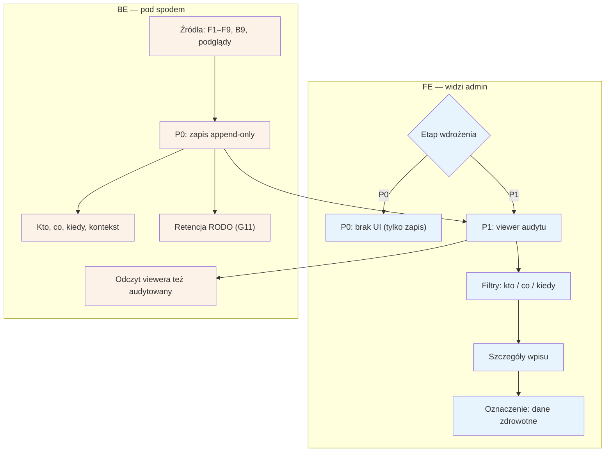

# F10 — Audit log

## Notatki
- Priorytet: P0 zapis → P1 viewer (wprost z mapy). W P0 nie ma UI — dostęp do logu np. bezpośrednio w bazie (S3: „co w P0 może być SQL-em").
- Zakres zapisu: kto co WIDZIAŁ i kto co ZMIENIŁ — dane zdrowotne pacjentów wymagają logowania samych odczytów (kluczowy konsument: podgląd konta w [[f5-uzytkownicy]] F5).
- Źródła wpisów: decyzje F1–F4, podglądy i akcje F5, billing F6, zmiany treści F7, konfiguracji F8, ról F9 oraz wnioski RODO z B9.
- Log append-only (bez edycji/usuwania wpisów przez adminów) — założenie minimalne, mapa nie precyzuje; retencja wpisów wg jobów RODO G11.
- Odczyt logu przez viewer sam też jest audytowany (założenie minimalne — spójność z zasadą „każdy dostęp do danych logowany").
- Powiązania: F1–F9 (źródła), B9, G11, S3 pkt 3.
