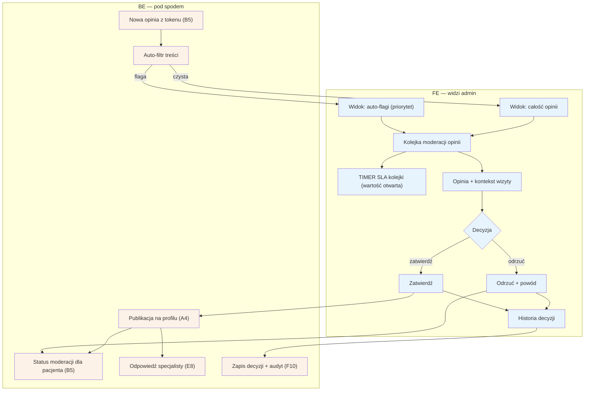

# F2 — Moderacja opinii

## Notatki
- Priorytet: P0.
- Interpretacja mapy „kolejka (auto-flagi + całość)": założenie minimalne — 100% opinii przechodzi przez moderację, auto-flagi z auto-filtra tylko priorytetyzują widok (podejrzane na wierzch).
- SLA kolejki: mapa nie podaje wartości (24 h robocze zdefiniowane tylko dla F1) — timer zaznaczony, wartość otwarta (do S3).
- Decyzja zawsze z powodem przy odrzuceniu; pacjent widzi status moderacji w [[b5-wystawienie-opinii]] (B5).
- Zatwierdzona opinia → profil A4 (badge wiarygodności) i możliwa odpowiedź specjalisty w E8.
- Opinia zakwestionowana przez specjalistę po publikacji → spór w [[f3-spory]] (F3).
- Historia decyzji widoczna w module; każdy wpis także w audycie F10.
- Powiązania: B5, E8, A4, F3, F10, G3/G4 (pipeline opinii), prompt #1.

## Co opisuje ten diagram
Diagram pokazuje, jak admin moderuje opinie pacjentów, zanim pojawią się publicznie. Każda nowa opinia (wystawiona przez pacjenta po wizycie) przechodzi przez auto-filtr treści i trafia do kolejki moderacji — podejrzane opinie są oznaczane flagą i pokazywane w pierwszej kolejności. Admin zatwierdza opinię, która wtedy trafia na publiczny profil specjalisty (specjalista może na nią odpowiedzieć), albo odrzuca ją z podanym powodem. Pacjent przez cały czas widzi status moderacji swojej opinii.

## Powiązane diagramy
| ID | Diagram | Jak się łączy |
|---|---|---|
| B5 | [b5-wystawienie-opinii.md](../b-pacjent-konto/b5-wystawienie-opinii.md) | źródło opinii; pacjent widzi tam status moderacji |
| A4 | [a4-profil-specjalisty.md](../a-pacjent-public/a4-profil-specjalisty.md) | zatwierdzona opinia jest publikowana na profilu |
| E8 | [e8-approval-opinie.md](../e-panel/e8-approval-opinie.md) | specjalista odpowiada na opublikowaną opinię |
| F3 | [f3-spory.md](f3-spory.md) | opinia zakwestionowana po publikacji trafia do sporów |
| F10 | [f10-audit-log.md](f10-audit-log.md) | decyzje moderacyjne zapisywane w audycie |
| G3 | [00-katalog-eventow.md](../00-core/00-katalog-eventow.md) | prośba o opinię (review ask T+2 h) rozpoczyna pipeline opinii |
| G4 | [g4-auto-approval.md](../g-silniki/g4-auto-approval.md) | auto-approval wizyty poprzedza wystawienie opinii w pipeline |

## Słownik
| Pojęcie | Wyjaśnienie |
|---|---|
| Moderacja | Ręczne sprawdzenie opinii przez admina przed jej publikacją. |
| Auto-filtr treści | Automat, który wstępnie skanuje opinię i oznacza podejrzane treści. |
| Auto-flaga | Oznaczenie nadane przez auto-filtr, które wypycha opinię na początek kolejki. |
| Token | Jednorazowy link/klucz, dzięki któremu opinię może wystawić tylko pacjent po odbytej wizycie. |
| Kolejka moderacji | Lista opinii czekających na decyzję admina. |
| SLA | Obiecany maksymalny czas obsługi kolejki (wartość jeszcze nieustalona). |
| Publikacja | Udostępnienie zatwierdzonej opinii na publicznym profilu specjalisty. |
| Spór | Procedura, w której specjalista kwestionuje już opublikowaną opinię. |
| Audyt (audit log) | Trwały zapis każdej decyzji moderacyjnej: kto, kiedy, z jakim powodem. |
