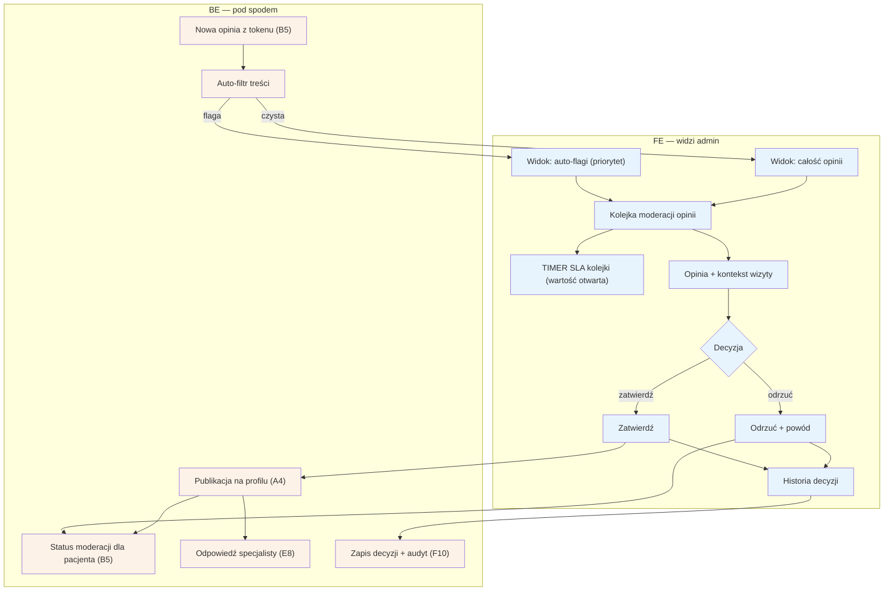

# F2 — Moderacja opinii

## Notatki
- Priorytet: P0.
- Interpretacja mapy „kolejka (auto-flagi + całość)": założenie minimalne — 100% opinii przechodzi przez moderację, auto-flagi z auto-filtra tylko priorytetyzują widok (podejrzane na wierzch).
- SLA kolejki: mapa nie podaje wartości (24 h robocze zdefiniowane tylko dla F1) — timer zaznaczony, wartość otwarta (do S3).
- Decyzja zawsze z powodem przy odrzuceniu; pacjent widzi status moderacji w [[b5-wystawienie-opinii]] (B5).
- Zatwierdzona opinia → profil A4 (badge wiarygodności) i możliwa odpowiedź specjalisty w E8.
- Opinia zakwestionowana przez specjalistę po publikacji → spór w [[f3-spory]] (F3).
- Historia decyzji widoczna w module; każdy wpis także w audycie F10.
- Powiązania: B5, E8, A4, F3, F10, G3/G4 (pipeline opinii), prompt #1.
