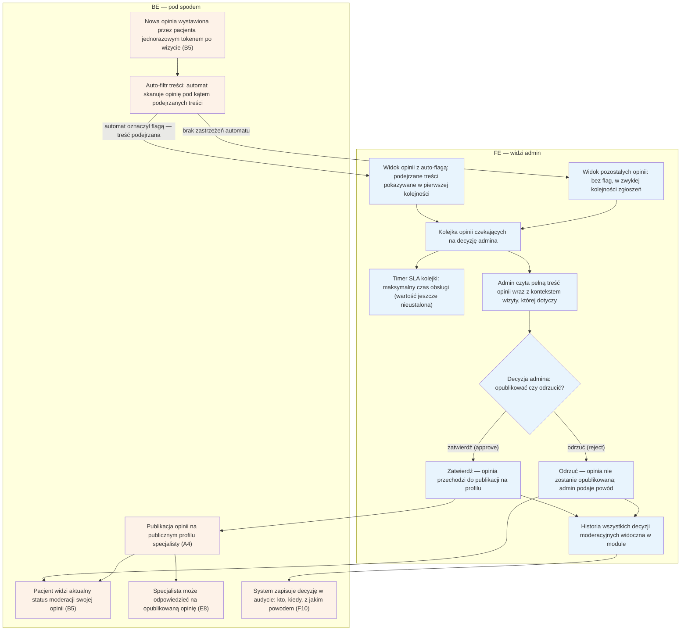

# F2 — Moderacja opinii

## Notatki
- Priorytet: P0.
- Interpretacja mapy „kolejka (auto-flagi + całość)": założenie minimalne — 100% opinii przechodzi przez moderację, auto-flagi z auto-filtra tylko priorytetyzują widok (podejrzane na wierzch).
- SLA kolejki: mapa nie podaje wartości (24 h robocze zdefiniowane tylko dla F1) — timer zaznaczony, wartość otwarta (do S3).
- Decyzja zawsze z powodem przy odrzuceniu; pacjent widzi status moderacji w [[b5-wystawienie-opinii]] (B5).
- Zatwierdzona opinia → profil A4 (badge wiarygodności) i możliwa odpowiedź specjalisty w E8.
- Opinia zakwestionowana przez specjalistę po publikacji → spór w [[f3-spory]] (F3).
- Historia decyzji widoczna w module; każdy wpis także w audycie F10.
- Powiązania: B5, E8, A4, F3, F10, G3/G4 (pipeline opinii), prompt #1.

## Co opisuje ten diagram
Diagram pokazuje, jak admin moderuje opinie pacjentów, zanim pojawią się publicznie. Każda nowa opinia (wystawiona przez pacjenta po wizycie) przechodzi przez auto-filtr treści i trafia do kolejki moderacji — podejrzane opinie są oznaczane flagą i pokazywane w pierwszej kolejności. Admin zatwierdza opinię, która wtedy trafia na publiczny profil specjalisty (specjalista może na nią odpowiedzieć), albo odrzuca ją z podanym powodem. Pacjent przez cały czas widzi status moderacji swojej opinii.

## Aktorzy w tym flow

| Rola | Kto to jest | Co robi w tym flow |
|---|---|---|
| **Admin** (operator platformy) | zespół prowadzący serwis — back office; główny użytkownik tego flow | przegląda kolejkę moderacji (najpierw opinie z auto-flagą), czyta treść z kontekstem wizyty i decyduje: zatwierdzić do publikacji albo odrzucić z powodem |
| **Pacjent** (użytkownik strony) | osoba, która była na wizycie; u logopedów najczęściej rodzic dziecka | autor opinii: wystawił ją jednorazowym tokenem po wizycie (B5) i przez cały czas widzi status moderacji |
| **Specjalista** (logopeda / lekarz) | usługodawca, którego dotyczy opinia | po publikacji może publicznie odpowiedzieć na opinię (E8); jeśli ją kwestionuje — otwiera spór (F3) |
| **System / Backend** | automaty platformy działające bez udziału człowieka | auto-filtr skanuje każdą nową opinię i nadaje flagi, system publikuje zatwierdzone opinie, aktualizuje status dla pacjenta i zapisuje decyzje w audycie (F10) |
| **Joby / Kolejka** | lista spraw czekających na obsługę i towarzyszące jej timery | kolejka porządkuje opinie do moderacji (flagowane na wierzchu); timer SLA pilnuje maksymalnego czasu obsługi |
| **FE** | panel administracyjny w przeglądarce — to, co admin widzi na ekranie | pokazuje kolejkę z dwoma widokami (auto-flagi / całość), szczegóły opinii, timer SLA, przyciski decyzji i historię decyzji |

## Objaśnienie bloków

| Blok | Co to znaczy w praktyce | Kto tu działa |
|---|---|---|
| Nowa opinia wystawiona tokenem (B5) | Punkt startu: pacjent po odbytej wizycie dostał jednorazowy link (token) i wystawił opinię. Token gwarantuje, że opinie piszą wyłącznie osoby, które naprawdę były na wizycie — nie da się ich wystawić „z ulicy". | Pacjent, System |
| Auto-filtr treści | Automat wstępnie skanuje każdą opinię, zanim zobaczy ją człowiek: szuka podejrzanych treści (np. wulgaryzmy, dane osobowe, spam, groźby). Nie podejmuje decyzji — tylko oznacza, co wygląda podejrzanie. | System |
| Widok opinii z auto-flagą | „Auto-flaga" to oznaczenie nadane przez auto-filtr. Opinie z flagą są wypychane na początek kolejki, żeby admin zajął się najpierw potencjalnie szkodliwymi treściami. Flaga nie przesądza o odrzuceniu — decyzję zawsze podejmuje człowiek. | Admin (widzi), System (flaguje) |
| Widok pozostałych opinii | Opinie, w których automat nie znalazł nic podejrzanego („czyste"). Też przechodzą przez moderację — 100% opinii wymaga decyzji admina, flagi zmieniają tylko kolejność obsługi. | Admin |
| Kolejka opinii czekających na decyzję | Wspólna lista wszystkich opinii do moderacji — każda czeka na decyzję admina, flagowane na wierzchu, reszta w kolejności zgłoszeń. | Admin |
| Timer SLA kolejki | SLA to obiecany maksymalny czas obsługi sprawy. Dla moderacji opinii konkretna wartość nie została jeszcze ustalona (w odróżnieniu od F1, gdzie to 24 h robocze) — timer jest przewidziany, liczba czeka na decyzję projektową. | System (odlicza), Admin (pilnuje) |
| Admin czyta opinię z kontekstem wizyty | Admin widzi pełną treść opinii oraz kontekst: jakiej wizyty dotyczy, u którego specjalisty, kiedy się odbyła. Kontekst pomaga ocenić, czy opinia jest wiarygodna i zgodna z zasadami. | Admin |
| Decyzja admina: opublikować czy odrzucić? | Moment rozstrzygnięcia — admin wybiera jedną z dwóch opcji: zatwierdź (approve) albo odrzuć (reject). | Admin |
| Zatwierdź — opinia przechodzi do publikacji | „Approve" = zatwierdzenie: opinia jest zgodna z zasadami i może zostać pokazana publicznie. | Admin |
| Odrzuć — opinia nie zostanie opublikowana | „Reject" = odrzucenie: opinia łamie zasady (np. obraźliwa treść) i nie trafi na profil. Admin obowiązkowo podaje powód — pacjent zobaczy go w statusie moderacji. | Admin |
| Publikacja opinii na profilu (A4) | System umieszcza zatwierdzoną opinię na publicznym profilu specjalisty, gdzie widzą ją wszyscy odwiedzający. | System |
| Pacjent widzi status moderacji (B5) | Autor opinii przez cały czas widzi, na jakim etapie jest jego opinia: czeka na moderację, opublikowana albo odrzucona (z powodem). | Pacjent, System |
| Specjalista może odpowiedzieć (E8) | Po publikacji specjalista może dodać publiczną odpowiedź na opinię — np. podziękować albo odnieść się do krytyki (flow E8). | Specjalista |
| Historia decyzji | Lista wcześniejszych decyzji moderacyjnych widoczna w module — pozwala adminom zachować spójność ocen i sprawdzić, jak rozstrzygano podobne przypadki. | Admin |
| System zapisuje decyzję w audycie (F10) | Każda decyzja (zatwierdzenie i odrzucenie) trafia dodatkowo do trwałego rejestru audytowego: kto ją podjął, kiedy i z jakim powodem — zabezpieczenie na wypadek sporów i reklamacji. | System |

## Powiązane diagramy
| ID | Diagram | Jak się łączy |
|---|---|---|
| B5 | [b5-wystawienie-opinii.md](../b-pacjent-konto/b5-wystawienie-opinii.md) | źródło opinii; pacjent widzi tam status moderacji |
| A4 | [a4-profil-specjalisty.md](../a-pacjent-public/a4-profil-specjalisty.md) | zatwierdzona opinia jest publikowana na profilu |
| E8 | [e8-approval-opinie.md](../e-panel/e8-approval-opinie.md) | specjalista odpowiada na opublikowaną opinię |
| F3 | [f3-spory.md](f3-spory.md) | opinia zakwestionowana po publikacji trafia do sporów |
| F10 | [f10-audit-log.md](f10-audit-log.md) | decyzje moderacyjne zapisywane w audycie |
| G3 | [00-katalog-eventow.md](../00-core/00-katalog-eventow.md) | prośba o opinię (review ask T+2 h) rozpoczyna pipeline opinii |
| G4 | [g4-auto-approval.md](../g-silniki/g4-auto-approval.md) | auto-approval wizyty poprzedza wystawienie opinii w pipeline |

## Słownik
| Pojęcie | Wyjaśnienie |
|---|---|
| Moderacja | Ręczne sprawdzenie opinii przez admina przed jej publikacją. |
| Auto-filtr treści | Automat, który wstępnie skanuje opinię i oznacza podejrzane treści. |
| Auto-flaga | Oznaczenie nadane przez auto-filtr, które wypycha opinię na początek kolejki. |
| Token | Jednorazowy link/klucz, dzięki któremu opinię może wystawić tylko pacjent po odbytej wizycie. |
| Kolejka moderacji | Lista opinii czekających na decyzję admina. |
| SLA | Obiecany maksymalny czas obsługi kolejki (wartość jeszcze nieustalona). |
| Publikacja | Udostępnienie zatwierdzonej opinii na publicznym profilu specjalisty. |
| Spór | Procedura, w której specjalista kwestionuje już opublikowaną opinię. |
| Audyt (audit log) | Trwały zapis każdej decyzji moderacyjnej: kto, kiedy, z jakim powodem. |
| Zatwierdź / Odrzuć (approve/reject) | Dwie możliwe decyzje admina: zatwierdzenie kieruje opinię do publikacji na profilu, odrzucenie blokuje publikację i wymaga podania powodu. |
| Kontekst wizyty | Informacje o wizycie, której dotyczy opinia (u kogo, kiedy, jaka usługa) — pomagają adminowi ocenić wiarygodność treści. |
| Historia decyzji | Lista wcześniejszych decyzji moderacyjnych w module — punkt odniesienia dla spójnych ocen podobnych przypadków. |
| Badge wiarygodności | Oznaczenie przy opublikowanej opinii na profilu informujące, że pochodzi od pacjenta po faktycznie odbytej wizycie. |
