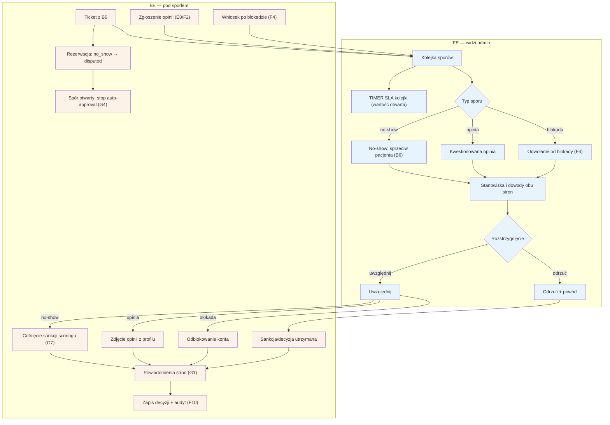

# F3 — Spory

## Notatki
- Priorytet: P1.
- Trzy typy sporów z mapy: (1) no-show „byłem/byłam" z [[b6-spor-no-show]] (B6), (2) kwestionowane opinie (specjalista kwestionuje opublikowaną opinię — z E8/F2), (3) odwołania od blokad nałożonych w [[f4-anty-abuse]] (F4).
- Stany rezerwacji: przy sporze no-show wizyta przechodzi `no_show → disputed` (stany kanoniczne). Otwarty spór blokuje auto-approval G4 (Flaga 3 z mapy).
- SLA kolejki: mapa nie podaje wartości — timer zaznaczony, wartość otwarta (do S3).
- Uwzględnienie sporu no-show = cofnięcie sankcji scoringu (G7); mapa nie definiuje kanonicznego stanu rezerwacji PO rozstrzygnięciu sporu (disputed → ?) — założenie minimalne: decyzja żyje w tickecie, stan rezerwacji bez zmian; zgłoszone jako rozbieżność.
- Odrzucenie zawsze z powodem; obie strony dostają powiadomienie (G1); decyzja w audycie F10.
- Powiązania: B6, E7, E8, F2, F4, G4, G7, G1, F10, prompt #4.
