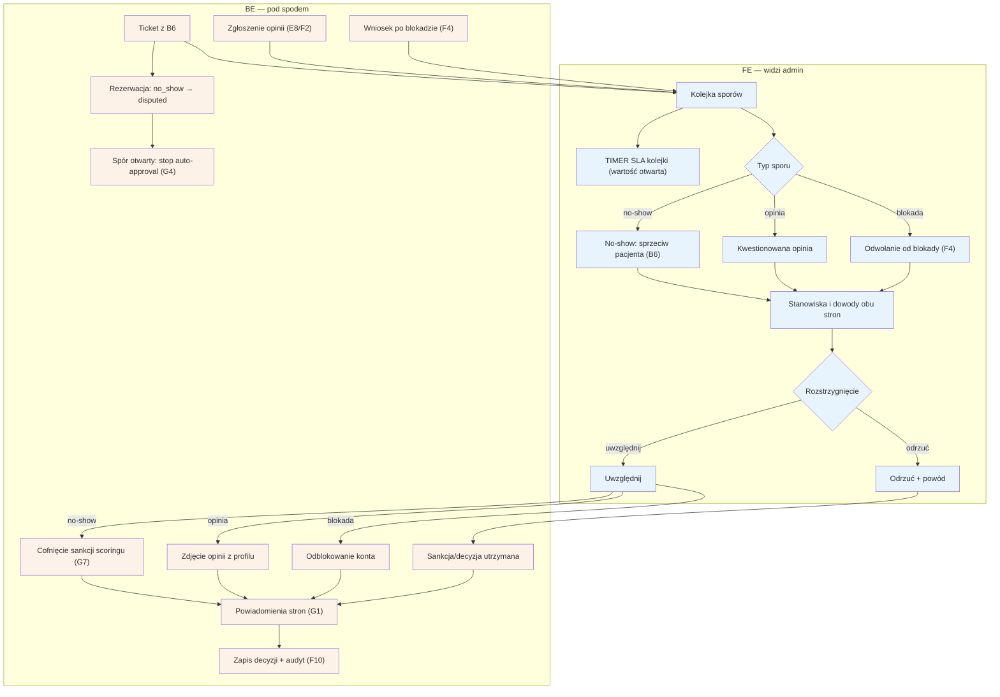

# F3 — Spory

## Notatki
- Priorytet: P1.
- Trzy typy sporów z mapy: (1) no-show „byłem/byłam" z [[b6-spor-no-show]] (B6), (2) kwestionowane opinie (specjalista kwestionuje opublikowaną opinię — z E8/F2), (3) odwołania od blokad nałożonych w [[f4-anty-abuse]] (F4).
- Stany rezerwacji: przy sporze no-show wizyta przechodzi `no_show → disputed` (stany kanoniczne). Otwarty spór blokuje auto-approval G4 (Flaga 3 z mapy).
- SLA kolejki: mapa nie podaje wartości — timer zaznaczony, wartość otwarta (do S3).
- Uwzględnienie sporu no-show = cofnięcie sankcji scoringu (G7); mapa nie definiuje kanonicznego stanu rezerwacji PO rozstrzygnięciu sporu (disputed → ?) — założenie minimalne: decyzja żyje w tickecie, stan rezerwacji bez zmian; zgłoszone jako rozbieżność.
- Odrzucenie zawsze z powodem; obie strony dostają powiadomienie (G1); decyzja w audycie F10.
- Powiązania: B6, E7, E8, F2, F4, G4, G7, G1, F10, prompt #4.

## Co opisuje ten diagram
Diagram pokazuje, jak admin rozstrzyga spory między stronami marketplace'u. Do kolejki trafiają trzy typy zgłoszeń: sprzeciw pacjenta wobec oznaczenia no-show („byłem/byłam na wizycie"), opinia kwestionowana przez specjalistę oraz odwołanie od blokady nałożonej przez anty-abuse. Admin ogląda stanowiska i dowody obu stron, po czym uwzględnia spór (cofa sankcję scoringu, zdejmuje opinię z profilu albo odblokowuje konto) lub odrzuca go z podanym powodem. Obie strony dostają powiadomienie, a otwarty spór no-show wstrzymuje automatyczne zatwierdzenie wizyty.

## Powiązane diagramy
| ID | Diagram | Jak się łączy |
|---|---|---|
| B6 | [b6-spor-no-show.md](../b-pacjent-konto/b6-spor-no-show.md) | sprzeciw pacjenta wobec no-show — źródło ticketów |
| E7 | [e7-no-show.md](../e-panel/e7-no-show.md) | oznaczenie no-show przez specjalistę poprzedza spór |
| E8 | [e8-approval-opinie.md](../e-panel/e8-approval-opinie.md) | specjalista kwestionuje tam opublikowaną opinię |
| F2 | [f2-moderacja-opinii.md](f2-moderacja-opinii.md) | zakwestionowana po publikacji opinia przechodzi z moderacji do sporu |
| F4 | [f4-anty-abuse.md](f4-anty-abuse.md) | odwołania od blokad nałożonych w anty-abuse |
| G4 | [g4-auto-approval.md](../g-silniki/g4-auto-approval.md) | otwarty spór blokuje auto-approval wizyty |
| G7 | [g7-scoring-engine.md](../g-silniki/g7-scoring-engine.md) | uwzględnienie sporu no-show cofa sankcję scoringu |
| G1 | [00-katalog-eventow.md](../00-core/00-katalog-eventow.md) | powiadomienia obu stron o rozstrzygnięciu |
| F10 | [f10-audit-log.md](f10-audit-log.md) | każde rozstrzygnięcie zapisywane w audycie |

## Słownik
| Pojęcie | Wyjaśnienie |
|---|---|
| Spór | Sprawa, w której jedna strona kwestionuje decyzję lub zdarzenie i prosi admina o rozstrzygnięcie. |
| Ticket | Pojedyncze zgłoszenie sporu czekające w kolejce na obsługę. |
| No-show | Sytuacja, gdy pacjent nie stawił się na umówioną wizytę. |
| disputed | Stan rezerwacji oznaczający, że no-show jest kwestionowany i sprawa czeka na rozstrzygnięcie. |
| Sankcja | Konsekwencja nałożona na pacjenta za no-show lub późne odwołanie (np. wymóg przedpłaty). |
| Scoring | Wewnętrzna ocena wiarygodności pacjenta, na którą wpływają no-show i późne odwołania. |
| Auto-approval | Automatyczne zatwierdzenie odbytej wizyty po 48 h, wstrzymywane na czas sporu. |
| Blokada | Odcięcie użytkownikowi dostępu do konta lub rezerwacji, od którego można się odwołać. |
| SLA | Obiecany maksymalny czas obsługi kolejki (wartość jeszcze nieustalona). |
| Audyt (audit log) | Trwały zapis decyzji: kto rozstrzygnął, kiedy i z jakim powodem. |
