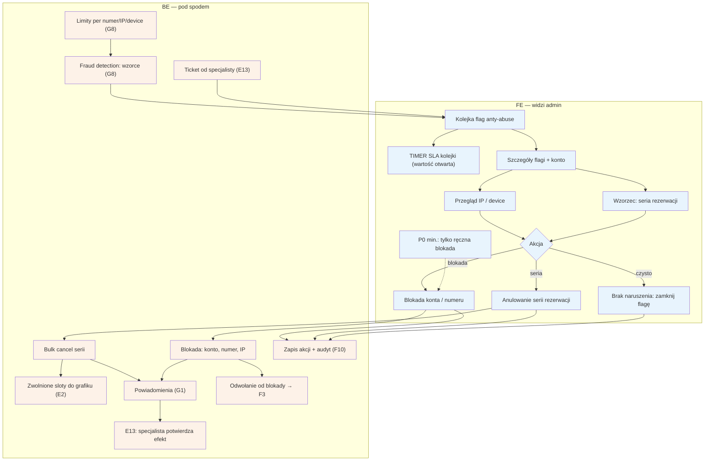

# F4 — Anty-abuse

## Notatki
- Priorytet: P0 min. = ręczna blokada (bez automatu G8); pełny moduł z flagami wzorców → P1 (G8 jest P1).
- Dwa źródła kolejki: auto-flagi z fraud detection [[G8]] (wzorce multikont, limity per numer/IP/device) oraz ticket od specjalisty „podejrzewam blokowanie kalendarza" → E13.
- Anulowanie serii: bulk cancel zwalnia sloty z powrotem do grafiku (E2); ścieżka E2E „Sabotaż slotów": seria → G8 flaga → F4 → anulowanie serii → E13 potwierdza.
- Mapa/CLAUDE.md nie definiują kanonicznego stanu rezerwacji dla anulowania przez ADMINA (są tylko cancelled_by_patient / cancelled_by_specialist) — zgłoszone jako rozbieżność; w diagramie neutralne „bulk cancel serii".
- Zablokowany użytkownik może się odwołać → [[f3-spory]] (F3: odwołania od blokad).
- SLA kolejki: brak wartości w mapie — timer zaznaczony, wartość otwarta (do S3).
- Wszystkie akcje (blokada, anulowanie, zamknięcie) w audycie F10.
- Powiązania: E13, G8, F3, E2, G1, F10, prompt #4.

## Co opisuje ten diagram
Diagram pokazuje, jak admin reaguje na nadużycia — przede wszystkim sabotaż kalendarza specjalisty przez serię fikcyjnych rezerwacji blokujących terminy. Kolejkę zasilają automatyczne flagi z systemu wykrywania oszustw (wzorce zachowań, limity na numer telefonu, IP i urządzenie) oraz zgłoszenia od samych specjalistów. Admin analizuje flagę i konto, po czym blokuje konto lub numer, anuluje całą serię rezerwacji (zwolnione terminy wracają do grafiku) albo zamyka flagę jako bezzasadną. Zablokowany użytkownik może się odwołać w module sporów.

## Powiązane diagramy
| ID | Diagram | Jak się łączy |
|---|---|---|
| E13 | [e13-zgloszenie-abuse.md](../e-panel/e13-zgloszenie-abuse.md) | ticket specjalisty zasila kolejkę, a specjalista potwierdza efekt akcji |
| G8 | [00-katalog-eventow.md](../00-core/00-katalog-eventow.md) | fraud detection dostarcza auto-flagi i limity per numer/IP/device |
| F3 | [f3-spory.md](f3-spory.md) | odwołanie zablokowanego użytkownika od blokady |
| E2 | [e2-grafik-dostepnosc.md](../e-panel/e2-grafik-dostepnosc.md) | anulowanie serii zwalnia sloty z powrotem do grafiku |
| G1 | [00-katalog-eventow.md](../00-core/00-katalog-eventow.md) | powiadomienia o blokadzie i anulowaniach |
| F10 | [f10-audit-log.md](f10-audit-log.md) | wszystkie akcje admina zapisywane w audycie |
| E2E-5 | [e2e-5-sabotaz-slotow.md](../e2e/e2e-5-sabotaz-slotow.md) | pełna ścieżka „sabotaż slotów" przechodzi przez ten moduł |

## Słownik
| Pojęcie | Wyjaśnienie |
|---|---|
| Anty-abuse | Moduł do wykrywania i powstrzymywania nadużyć w serwisie. |
| Flaga | Automatyczne lub ręczne oznaczenie podejrzanej aktywności do sprawdzenia przez admina. |
| Fraud detection | Automat wykrywający podejrzane wzorce, np. wiele rezerwacji z jednego urządzenia. |
| Sabotaż slotów | Celowe blokowanie kalendarza specjalisty fikcyjnymi rezerwacjami. |
| Limit per numer/IP/device | Ograniczenie liczby rezerwacji z jednego numeru telefonu, adresu internetowego lub urządzenia. |
| Bulk cancel | Hurtowe anulowanie całej serii rezerwacji jedną akcją. |
| Slot | Pojedynczy wolny termin wizyty w grafiku specjalisty. |
| Ticket | Zgłoszenie od specjalisty czekające w kolejce na obsługę. |
| Blokada | Odcięcie konta, numeru lub IP od możliwości rezerwowania. |
| Audyt (audit log) | Trwały zapis każdej akcji admina: kto, co i kiedy zrobił. |
