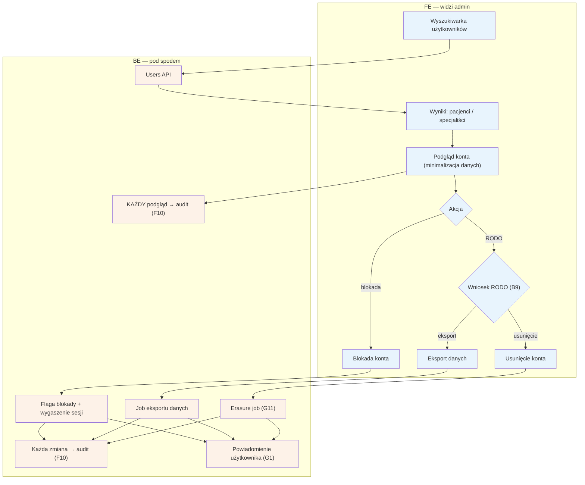

# F5 — Użytkownicy

## Notatki
- Priorytet: P0.
- Kluczowy wymóg mapy: podgląd konta ZAWSZE z audytem dostępu — każdy odczyt danych pacjenta (dane zdrowotne!) trafia do [[f10-audit-log]] (F10), niezależnie od tego, czy admin coś zmienił. Prezentacja danych adminowi z minimalizacją (S3 pkt 3).
- Obsługa wniosków RODO z [[b9-rodo-self-service]] (B9): eksport danych (job) i usunięcie konta (erasure job G11); powiadomienie użytkownika o realizacji przez G1.
- Blokada konta: flaga + wygaszenie aktywnych sesji; odwołanie od blokady → [[f3-spory]] (F3).
- Założenie minimalne: mapa nie rozstrzyga, czy wniosek RODO złożony w B9 wymaga zawsze ręcznej obsługi w F5, czy bywa w pełni automatyczny — przyjęto: admin obsługuje/nadzoruje wniosek w F5.
- Powiązania: B9, G11, F3, F10, G1.

## Co opisuje ten diagram
Diagram pokazuje moduł zarządzania kontami użytkowników (pacjentów i specjalistów) w panelu admina. Admin wyszukuje konto i podgląda je z zachowaniem minimalizacji danych — a ponieważ w grę wchodzą dane zdrowotne, każdy sam podgląd jest zapisywany w audycie, nawet bez żadnej zmiany. Admin może zablokować konto (z wygaszeniem aktywnych sesji) albo obsłużyć wniosek RODO: eksport danych lub trwałe usunięcie konta. Użytkownik dostaje powiadomienie o każdej wykonanej akcji.

## Powiązane diagramy
| ID | Diagram | Jak się łączy |
|---|---|---|
| B9 | [b9-rodo-self-service.md](../b-pacjent-konto/b9-rodo-self-service.md) | stąd przychodzą wnioski RODO składane przez pacjenta |
| G11 | [00-katalog-eventow.md](../00-core/00-katalog-eventow.md) | erasure job RODO realizuje usunięcie danych |
| F3 | [f3-spory.md](f3-spory.md) | odwołanie użytkownika od blokady konta |
| F10 | [f10-audit-log.md](f10-audit-log.md) | każdy podgląd i każda zmiana konta logowane w audycie |
| G1 | [00-katalog-eventow.md](../00-core/00-katalog-eventow.md) | powiadomienie użytkownika o blokadzie lub realizacji wniosku |

## Słownik
| Pojęcie | Wyjaśnienie |
|---|---|
| RODO | Przepisy o ochronie danych osobowych dające użytkownikowi m.in. prawo do kopii i usunięcia swoich danych. |
| Minimalizacja danych | Zasada pokazywania adminowi tylko tych danych, które są niezbędne do wykonania zadania. |
| Dane zdrowotne | Szczególnie chronione dane o zdrowiu pacjenta — każdy dostęp do nich musi być rejestrowany. |
| Audyt dostępu | Zapis w logu każdego podglądu konta, nawet jeśli admin niczego nie zmienił. |
| Erasure job | Automatyczne zadanie systemowe trwale usuwające dane użytkownika po wniosku o usunięcie konta. |
| Eksport danych | Przygotowanie dla użytkownika kopii wszystkich jego danych z serwisu. |
| Blokada konta | Odebranie użytkownikowi dostępu do serwisu przez oznaczenie konta flagą blokady. |
| Wygaszenie sesji | Natychmiastowe wylogowanie użytkownika ze wszystkich urządzeń przy blokadzie. |
