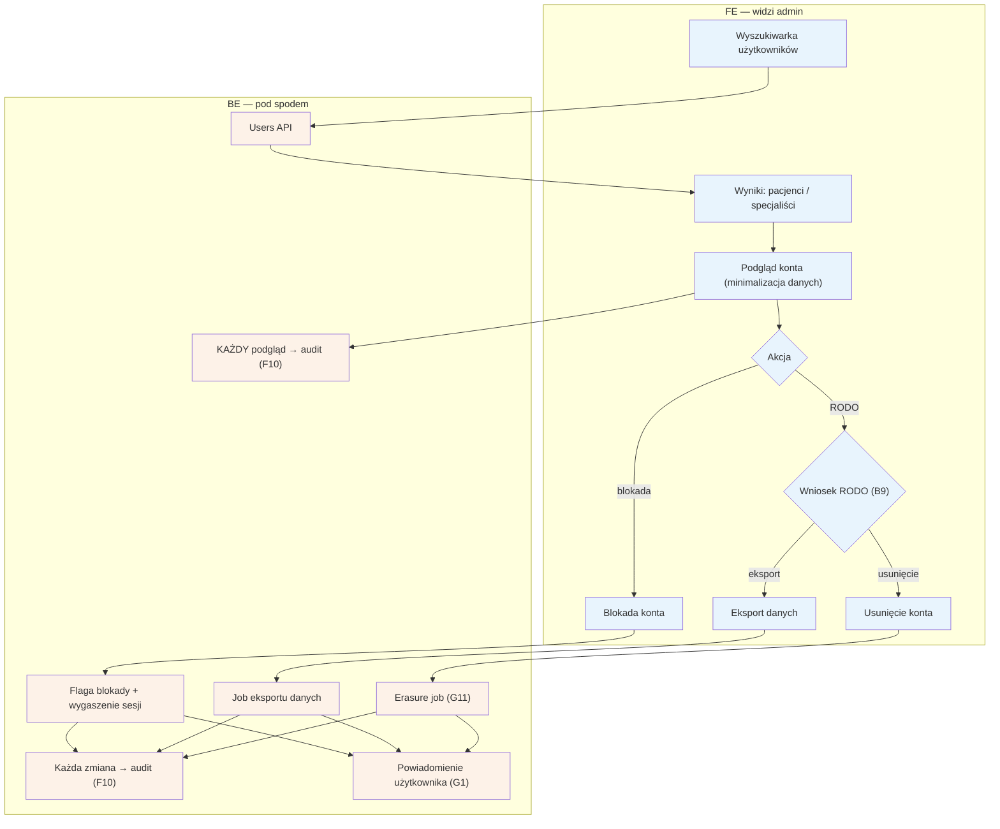

# F5 — Użytkownicy

## Notatki
- Priorytet: P0.
- Kluczowy wymóg mapy: podgląd konta ZAWSZE z audytem dostępu — każdy odczyt danych pacjenta (dane zdrowotne!) trafia do [[f10-audit-log]] (F10), niezależnie od tego, czy admin coś zmienił. Prezentacja danych adminowi z minimalizacją (S3 pkt 3).
- Obsługa wniosków RODO z [[b9-rodo-self-service]] (B9): eksport danych (job) i usunięcie konta (erasure job G11); powiadomienie użytkownika o realizacji przez G1.
- Blokada konta: flaga + wygaszenie aktywnych sesji; odwołanie od blokady → [[f3-spory]] (F3).
- Założenie minimalne: mapa nie rozstrzyga, czy wniosek RODO złożony w B9 wymaga zawsze ręcznej obsługi w F5, czy bywa w pełni automatyczny — przyjęto: admin obsługuje/nadzoruje wniosek w F5.
- Powiązania: B9, G11, F3, F10, G1.
