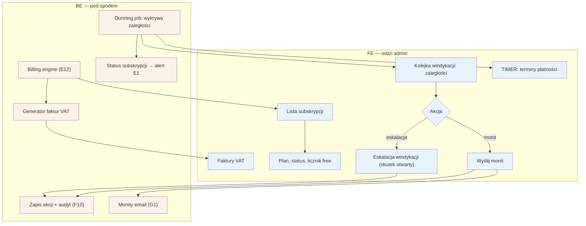

# F6 — Billing admin

## Notatki
- Priorytet: P1 (spójne z E12: billing P1, widoczność licznika free P0).
- Zakres z mapy: subskrypcje, faktury, windykacja — po stronie specjalisty odpowiada temu [[E12]] (plan, metoda płatności, faktury, licznik „free do DD.MM od dnia 1").
- Windykacja: dunning job wykrywa zaległości (timer terminów płatności), admin wysyła monity (G1); status subskrypcji podbija alert na dashboardzie specjalisty (E1).
- Rozbieżność/otwarte: mapa nie definiuje skutku nieskutecznej windykacji (zawieszenie konta? ukrycie profilu?) — węzeł „eskalacja (skutek otwarty)", decyzja do promptu #2 (model subskrypcji).
- Założenie minimalne: brak w mapie korekt/anulowania faktur przez admina — nie dodano.
- Akcje admina w audycie F10.
- Powiązania: E12, E1, C2, G1, F10, prompt #2.

## Co opisuje ten diagram
Diagram pokazuje administracyjną stronę rozliczeń ze specjalistami. Admin przegląda listę subskrypcji, ich plany, liczniki okresu darmowego i faktury VAT. System (dunning job) automatycznie wykrywa zaległości płatnicze i buduje z nich kolejkę windykacji — admin wysyła monity e-mail, a w razie potrzeby eskaluje sprawę (skutek eskalacji nie jest jeszcze rozstrzygnięty w mapie). Zaległość podbija też alert na dashboardzie specjalisty.

## Powiązane diagramy
| ID | Diagram | Jak się łączy |
|---|---|---|
| E12 | [e12-subskrypcja-billing.md](../e-panel/e12-subskrypcja-billing.md) | strona specjalisty tego samego billingu: plan, płatności, faktury, licznik free |
| E1 | [e1-dashboard.md](../e-panel/e1-dashboard.md) | status subskrypcji wyświetla alert na dashboardzie specjalisty |
| C2 | [c2-cennik-b2b.md](../cd-specjalista-onboarding/c2-cennik-b2b.md) | cennik B2B definiuje plany subskrypcji widoczne w module |
| G1 | [00-katalog-eventow.md](../00-core/00-katalog-eventow.md) | monity wysyłane e-mailem przez notification engine |
| F10 | [f10-audit-log.md](f10-audit-log.md) | akcje admina (monit, eskalacja) zapisywane w audycie |

## Słownik
| Pojęcie | Wyjaśnienie |
|---|---|
| Subskrypcja | Płatny abonament specjalisty za korzystanie z serwisu. |
| Billing | Całość rozliczeń: plany, płatności, faktury i pilnowanie terminów. |
| Faktura VAT | Dokument sprzedaży wystawiany specjaliście automatycznie przez system. |
| Licznik free | Odliczanie, ile darmowego okresu próbnego zostało specjaliście. |
| Windykacja | Proces upominania się o zaległe płatności. |
| Dunning job | Automat, który cyklicznie sprawdza terminy płatności i wykrywa zaległości. |
| Monit | Wiadomość przypominająca specjaliście o zaległej płatności. |
| Eskalacja | Kolejny, ostrzejszy krok windykacji, gdy monity nie działają (skutek jeszcze nieustalony). |
| Audyt (audit log) | Trwały zapis akcji admina: kto, co i kiedy zrobił. |
