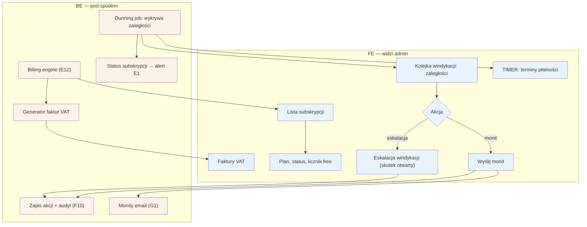

# F6 — Billing admin

## Notatki
- Priorytet: P1 (spójne z E12: billing P1, widoczność licznika free P0).
- Zakres z mapy: subskrypcje, faktury, windykacja — po stronie specjalisty odpowiada temu [[E12]] (plan, metoda płatności, faktury, licznik „free do DD.MM od dnia 1").
- Windykacja: dunning job wykrywa zaległości (timer terminów płatności), admin wysyła monity (G1); status subskrypcji podbija alert na dashboardzie specjalisty (E1).
- Rozbieżność/otwarte: mapa nie definiuje skutku nieskutecznej windykacji (zawieszenie konta? ukrycie profilu?) — węzeł „eskalacja (skutek otwarty)", decyzja do promptu #2 (model subskrypcji).
- Założenie minimalne: brak w mapie korekt/anulowania faktur przez admina — nie dodano.
- Akcje admina w audycie F10.
- Powiązania: E12, E1, C2, G1, F10, prompt #2.
