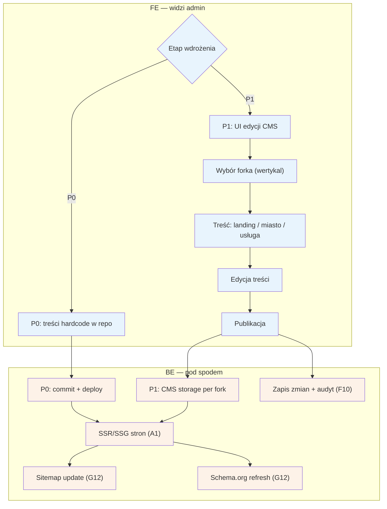

# F7 — CMS/SEO

## Notatki
- Priorytet: P0 hardcode → P1 UI (wprost z mapy). W P0 „edycja" = zmiana w repo + deploy, bez UI admina; węzeł decyzyjny „etap wdrożenia" pokazuje oba warianty.
- Typy treści z mapy: landing wertykalu, strony `/{miasto}`, `/uslugi/{usluga}/{miasto}` — per fork (multi-wertykal, jeden Back Office).
- Publikacja zasila SSR/SSG (A1) i uruchamia SEO joby G12 (sitemap, schema.org refresh) — spójne z [[a1-wejscie-seo]] i A9 (strony statyczne: „CMS lub hardcode na start").
- Szablony treści, unikalność, internal linking — poza zakresem F7, temat S5 (programmatic SEO).
- Zmiany treści w audycie F10 (P1).
- Powiązania: A1, A9, G12, F8 (konfiguracja forka), F10, S5.

## Co opisuje ten diagram
Diagram pokazuje zarządzanie treściami serwisu (landingi, strony miast i usług), które przyciągają pacjentów z wyszukiwarek. Na starcie (etap P0) treści są zapisane na sztywno w kodzie i zmienia się je przez wgranie nowej wersji serwisu; docelowo (etap P1) admin edytuje je w interfejsie CMS-a, osobno dla każdego forka, czyli wertykalu. Publikacja odświeża strony widoczne dla pacjentów i uruchamia automatyczne zadania SEO: aktualizację sitemapy i danych schema.org.

## Powiązane diagramy
| ID | Diagram | Jak się łączy |
|---|---|---|
| A1 | [a1-wejscie-seo.md](../a-pacjent-public/a1-wejscie-seo.md) | opublikowane treści zasilają strony, na które pacjent wchodzi z wyszukiwarki |
| A9 | [a9-strony-statyczne.md](../a-pacjent-public/a9-strony-statyczne.md) | strony statyczne pochodzą z CMS-a lub hardcode'u |
| G12 | [00-katalog-eventow.md](../00-core/00-katalog-eventow.md) | publikacja uruchamia joby SEO: sitemap i schema.org refresh |
| F8 | [f8-konfiguracja-forka.md](f8-konfiguracja-forka.md) | treści są prowadzone per fork zdefiniowany w konfiguracji |
| F10 | [f10-audit-log.md](f10-audit-log.md) | zmiany treści (w etapie P1) zapisywane w audycie |

## Słownik
| Pojęcie | Wyjaśnienie |
|---|---|
| CMS | System do edycji treści stron przez admina bez zmieniania kodu. |
| SEO | Działania zwiększające widoczność serwisu w wynikach wyszukiwarek. |
| Fork | Osobna kopia serwisu dla innej branży, korzystająca ze wspólnego rdzenia. |
| Wertykal | Branża/specjalizacja obsługiwana przez dany fork (np. logopedzi). |
| Hardcode | Treści wpisane na stałe w kod serwisu — zmiana wymaga programisty i deployu. |
| Deploy | Wgranie nowej wersji serwisu na serwery. |
| SSR/SSG | Sposób budowania stron na serwerze, dzięki któremu wyszukiwarki dobrze je indeksują. |
| Sitemap | Mapa wszystkich stron serwisu przekazywana wyszukiwarkom. |
| Schema.org | Ustandaryzowane znaczniki w treści strony, które pomagają wyszukiwarce zrozumieć, co na niej jest. |
