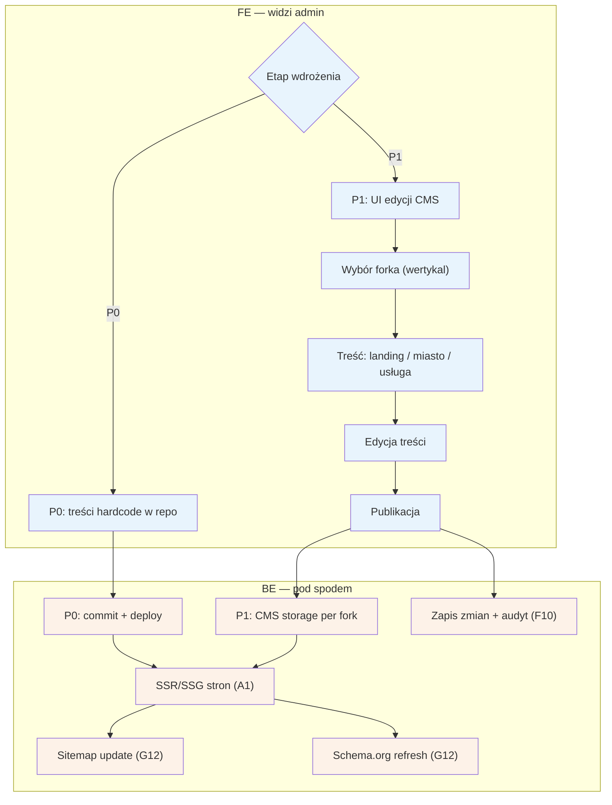

# F7 — CMS/SEO

## Notatki
- Priorytet: P0 hardcode → P1 UI (wprost z mapy). W P0 „edycja" = zmiana w repo + deploy, bez UI admina; węzeł decyzyjny „etap wdrożenia" pokazuje oba warianty.
- Typy treści z mapy: landing wertykalu, strony `/{miasto}`, `/uslugi/{usluga}/{miasto}` — per fork (multi-wertykal, jeden Back Office).
- Publikacja zasila SSR/SSG (A1) i uruchamia SEO joby G12 (sitemap, schema.org refresh) — spójne z [[a1-wejscie-seo]] i A9 (strony statyczne: „CMS lub hardcode na start").
- Szablony treści, unikalność, internal linking — poza zakresem F7, temat S5 (programmatic SEO).
- Zmiany treści w audycie F10 (P1).
- Powiązania: A1, A9, G12, F8 (konfiguracja forka), F10, S5.
