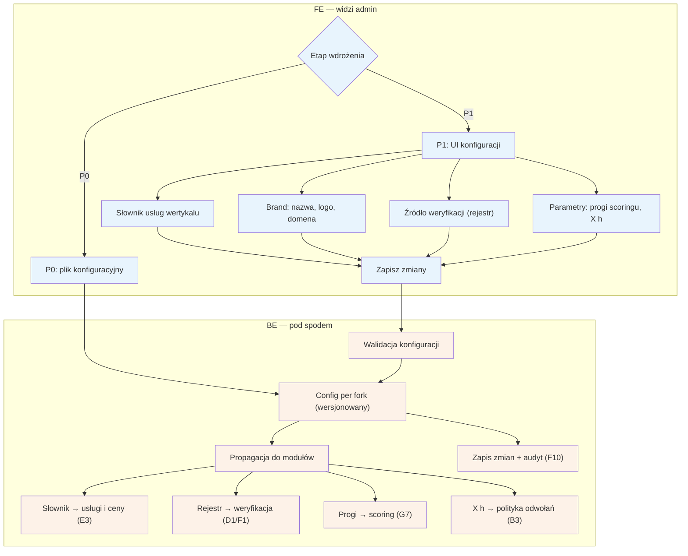

# F8 — Konfiguracja forka

## Notatki
- Priorytet: P0 plik konfiguracyjny → P1 UI (wprost z mapy); w P0 zmiana konfiguracji = edycja pliku w repo forka.
- Zakres konfiguracji z mapy: słownik usług (zasila CRUD w [[E3]]), brand, źródło weryfikacji (który rejestr sprawdza automat [[d1-weryfikacja-pwz]]/F1: KRL/KIF/wet.), parametry — progi scoringu (G7) i okno X h polityki odwołań (B3/E5).
- Założenie minimalne: config wersjonowany + walidowany przed propagacją (błędny prog scoringu nie może wywrócić gate'u w A5) — mapa tego nie precyzuje.
- Architektura z mapy: core repo-matka + forki per wertykal, Back Office wspólny — F8 to jedyne miejsce różnicujące forki parametrycznie.
- Zmiany konfiguracji w audycie F10 (parametry wpływają na sankcje wobec użytkowników).
- Powiązania: E3, D1, F1, G7, B3, E5, A5 (scoring gate), F10.
