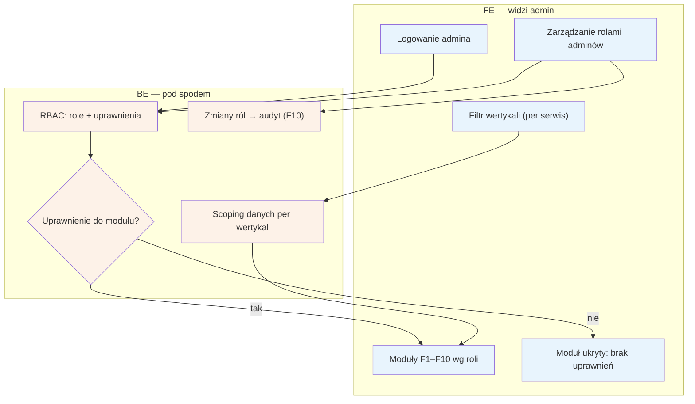

# F9 — RBAC + filtr wertykali

## Notatki
- Priorytet: P0, ale wg mapy „trywialne przy 1 serwisie" — na start (Kraków, logopedzi) filtr wertykali ma jedną wartość; struktura gotowa pod kolejne forki.
- Back Office jest jeden fizycznie dla wszystkich wertykali — filtr per serwis scopuje dane we WSZYSTKICH modułach F1–F10 (kolejki, użytkownicy, billing, CMS, konfiguracja).
- Model uprawnień: 3-osobowy zespół założycielski + przyszli moderatorzy (S3 pkt 4) — mapa nie definiuje listy ról; założenie minimalne: role przypisują dostęp per moduł F1–F10.
- Zmiany ról w audycie F10 (kto komu nadał dostęp do danych zdrowotnych).
- Założenie minimalne: logowanie admina bez szczegółów w mapie (metoda auth otwarta — do S3).
- Powiązania: wszystkie moduły F1–F10, F10 (audyt), S3.

## Co opisuje ten diagram
Diagram pokazuje kontrolę dostępu do Back Office'u (panelu admina). Po zalogowaniu admin widzi tylko te moduły F1–F10, do których jego rola daje uprawnienia (RBAC) — moduły bez uprawnień są ukryte. Filtr wertykali zawęża dane do wybranego serwisu, bo Back Office jest fizycznie jeden dla wszystkich forków. Tutaj też zarządza się rolami adminów, a każda zmiana ról trafia do audytu.

## Powiązane diagramy
| ID | Diagram | Jak się łączy |
|---|---|---|
| F1 | [f1-kolejka-weryfikacji-pwz.md](f1-kolejka-weryfikacji-pwz.md) | dostęp do kolejki weryfikacji zależny od roli i wertykalu |
| F2 | [f2-moderacja-opinii.md](f2-moderacja-opinii.md) | dostęp do moderacji opinii zależny od roli i wertykalu |
| F3 | [f3-spory.md](f3-spory.md) | dostęp do sporów zależny od roli i wertykalu |
| F4 | [f4-anty-abuse.md](f4-anty-abuse.md) | dostęp do anty-abuse zależny od roli i wertykalu |
| F5 | [f5-uzytkownicy.md](f5-uzytkownicy.md) | dostęp do danych użytkowników zależny od roli i wertykalu |
| F6 | [f6-billing-admin.md](f6-billing-admin.md) | dostęp do billingu zależny od roli i wertykalu |
| F7 | [f7-cms-seo.md](f7-cms-seo.md) | dostęp do CMS/SEO zależny od roli i wertykalu |
| F8 | [f8-konfiguracja-forka.md](f8-konfiguracja-forka.md) | dostęp do konfiguracji forka zależny od roli i wertykalu |
| F10 | [f10-audit-log.md](f10-audit-log.md) | moduł też objęty RBAC, a zmiany ról zapisywane w audycie |

## Słownik
| Pojęcie | Wyjaśnienie |
|---|---|
| RBAC | Kontrola dostępu oparta na rolach: to rola admina decyduje, co może zobaczyć i zrobić. |
| Rola | Zestaw uprawnień przypisany adminowi, np. moderator opinii. |
| Uprawnienie | Prawo dostępu do konkretnego modułu Back Office'u. |
| Wertykal | Branża/serwis (np. logopedzi), do którego można zawęzić widok danych. |
| Filtr wertykali | Przełącznik w panelu wybierający, dane którego serwisu admin ogląda. |
| Scoping | Automatyczne ograniczenie danych we wszystkich modułach do wybranego wertykalu. |
| Fork | Osobna kopia serwisu dla innej branży — wszystkie forki obsługuje jeden Back Office. |
| Back Office | Wewnętrzny panel administracyjny serwisu (moduły F1–F10). |
| Dane zdrowotne | Szczególnie chronione dane pacjentów — dlatego nadawanie dostępów jest audytowane. |
