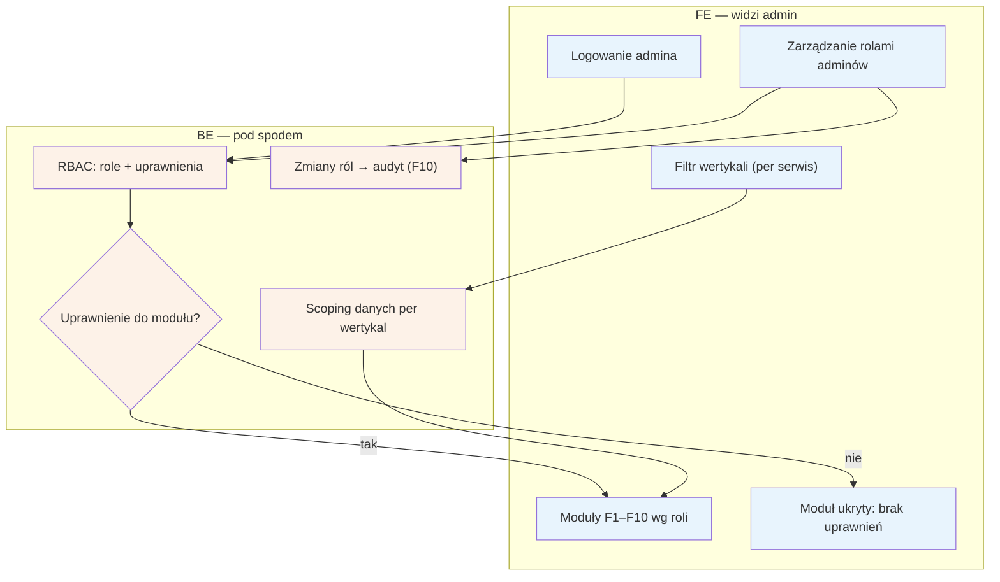

# F9 — RBAC + filtr wertykali

## Notatki
- Priorytet: P0, ale wg mapy „trywialne przy 1 serwisie" — na start (Kraków, logopedzi) filtr wertykali ma jedną wartość; struktura gotowa pod kolejne forki.
- Back Office jest jeden fizycznie dla wszystkich wertykali — filtr per serwis scopuje dane we WSZYSTKICH modułach F1–F10 (kolejki, użytkownicy, billing, CMS, konfiguracja).
- Model uprawnień: 3-osobowy zespół założycielski + przyszli moderatorzy (S3 pkt 4) — mapa nie definiuje listy ról; założenie minimalne: role przypisują dostęp per moduł F1–F10.
- Zmiany ról w audycie F10 (kto komu nadał dostęp do danych zdrowotnych).
- Założenie minimalne: logowanie admina bez szczegółów w mapie (metoda auth otwarta — do S3).
- Powiązania: wszystkie moduły F1–F10, F10 (audyt), S3.
