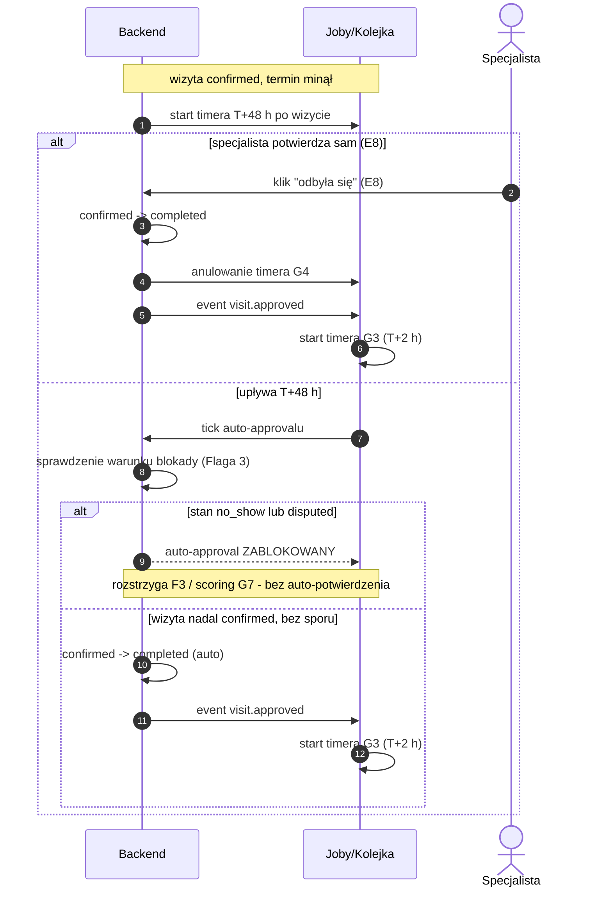

# G4 — Auto-approval T+48 h

## Notatki
- **Flaga 3 (pokazana wprost jako warunek):** auto-approval ZABLOKOWANY, gdy wizyta ma oznaczony no-show (E7, stan `no_show`) lub otwarty spór (B6 → F3, stan `disputed`) — inaczej system "potwierdza" wizytę, która się nie odbyła (fałszywy badge + zepsuty scoring).
- Po blokadzie G4 się nie wznawia — wynik ustala F3 (spór uznany → `completed`, odrzucony → `no_show`), zgodnie z CORE-STANY.
- Moment planowania timera: mapa nie rozstrzyga — założenie minimalne: przy wejściu w `confirmed` (booking.created), odpalenie T+48 h po terminie wizyty.
- Ręczny approval E8 ("lista wizyt do potwierdzenia") anuluje timer G4 — założenie minimalne.
- `visit.approved` — nazwa robocza (jak w CORE-STANY); konsument: G3 (review ask T+2 h) → przez G1 token opinii B5.
- Stany rezerwacji: tylko kanoniczne (`confirmed → completed`, blokady: `no_show`, `disputed`).
- Powiązania: [[00-stany-rezerwacji]] (CORE-STANY), [[00-katalog-eventow]] (CORE-EVENTY), E8, G3, E7, B6, F3, G7, B5.

## Co opisuje ten diagram

Ten diagram pokazuje, co dzieje się z wizytą po jej terminie, gdy specjalista nie potwierdzi ręcznie, że się odbyła. System odlicza 48 godzin od wizyty i — jeśli nic nie stoi na przeszkodzie — sam oznacza ją jako odbytą, a następnie uruchamia prośbę o opinię do pacjenta. Uczestniczą specjalista (może potwierdzić wizytę wcześniej sam) oraz system działający w tle; automat blokuje się, gdy specjalista oznaczył no-show albo pacjent otworzył spór. Flow kończy się stanem "wizyta odbyta" (completed) albo przekazaniem sprawy do rozstrzygnięcia przez administratora w module sporów.

## Powiązane diagramy

| ID | Diagram | Jak się łączy |
|---|---|---|
| CORE-STANY | [00-stany-rezerwacji.md](../00-core/00-stany-rezerwacji.md) | źródło kanonicznych stanów wizyty, po których porusza się ten silnik |
| CORE-EVENTY | [00-katalog-eventow.md](../00-core/00-katalog-eventow.md) | event `visit.approved` figuruje w katalogu eventów domenowych |
| E8 | [e8-approval-opinie.md](../e-panel/e8-approval-opinie.md) | ręczne potwierdzenie wizyty przez specjalistę anuluje timer auto-approvalu |
| E7 | [e7-no-show.md](../e-panel/e7-no-show.md) | oznaczenie no-show przez specjalistę blokuje auto-potwierdzenie |
| B6 | [b6-spor-no-show.md](../b-pacjent-konto/b6-spor-no-show.md) | otwarty spór pacjenta (stan `disputed`) również blokuje auto-potwierdzenie |
| F3 | [f3-spory.md](../f-backoffice/f3-spory.md) | po blokadzie wynik wizyty rozstrzyga admin w module sporów |
| G7 | [g7-scoring-engine.md](g7-scoring-engine.md) | wynik wizyty (no-show / spór) zasila scoring pacjenta |
| G3 | [00-katalog-eventow.md](../00-core/00-katalog-eventow.md) | po zatwierdzeniu wizyty startuje timer prośby o opinię (T+2 h) |
| G1 | [00-katalog-eventow.md](../00-core/00-katalog-eventow.md) | powiadomienia (m.in. token opinii) dostarcza notification engine |
| B5 | [b5-wystawienie-opinii.md](../b-pacjent-konto/b5-wystawienie-opinii.md) | prośba o opinię prowadzi pacjenta do formularza wystawienia opinii |

## Słownik

| Pojęcie | Wyjaśnienie |
|---|---|
| Auto-approval | Automatyczne uznanie wizyty za odbytą przez system, gdy specjalista sam jej nie potwierdzi. |
| Timer T+48 h | Odliczanie 48 godzin od terminu wizyty, po którym system próbuje potwierdzić ją automatycznie. |
| Event | Komunikat wysyłany przez system po zdarzeniu (np. `visit.approved`), na który reagują inne silniki. |
| `confirmed` → `completed` | Przejście wizyty ze stanu "potwierdzona" (umówiona) do "odbyta". |
| `no_show` | Stan wizyty, na którą pacjent się nie stawił. |
| `disputed` | Stan wizyty objętej sporem między pacjentem a specjalistą. |
| Joby/Kolejka | Mechanizm działający w tle, który wykonuje zaplanowane zadania i pilnuje timerów bez udziału człowieka. |
| Review ask (G3) | Automatyczna prośba do pacjenta o wystawienie opinii, wysyłana 2 godziny po potwierdzeniu wizyty. |
| Flaga 3 | Ustalona w projekcie zasada: auto-approval jest zablokowany, gdy wizyta ma no-show lub otwarty spór. |
| Scoring | Prowadzony przez silnik G7 licznik zachowań pacjenta (no-show, późne odwołania). |
