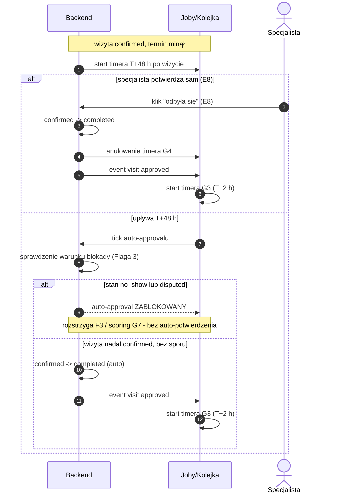

# G4 — Auto-approval T+48 h

## Notatki
- **Flaga 3 (pokazana wprost jako warunek):** auto-approval ZABLOKOWANY, gdy wizyta ma oznaczony no-show (E7, stan `no_show`) lub otwarty spór (B6 → F3, stan `disputed`) — inaczej system "potwierdza" wizytę, która się nie odbyła (fałszywy badge + zepsuty scoring).
- Po blokadzie G4 się nie wznawia — wynik ustala F3 (spór uznany → `completed`, odrzucony → `no_show`), zgodnie z CORE-STANY.
- Moment planowania timera: mapa nie rozstrzyga — założenie minimalne: przy wejściu w `confirmed` (booking.created), odpalenie T+48 h po terminie wizyty.
- Ręczny approval E8 ("lista wizyt do potwierdzenia") anuluje timer G4 — założenie minimalne.
- `visit.approved` — nazwa robocza (jak w CORE-STANY); konsument: G3 (review ask T+2 h) → przez G1 token opinii B5.
- Stany rezerwacji: tylko kanoniczne (`confirmed → completed`, blokady: `no_show`, `disputed`).
- Powiązania: [[00-stany-rezerwacji]] (CORE-STANY), [[00-katalog-eventow]] (CORE-EVENTY), E8, G3, E7, B6, F3, G7, B5.
