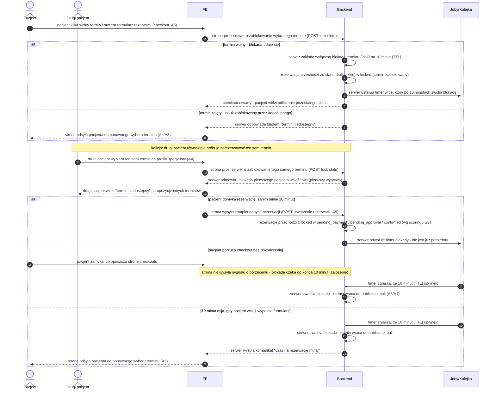

# G5 — Slot lock (TTL 10 min)

## Notatki
- Lock TTL 10 min od wejścia w checkout (A5); stany kanoniczne: `draft → locked`, dalej `pending_payment | pending_approval | confirmed` wg scoring gate G7 (CORE-STANY).
- **Kolizja równoległych checkoutów:** lock jest wyłączny — pierwszy pacjent wygrywa, drugi dostaje "slot niedostępny" i powrót do A4/A8; UX odmowy mapa nie rozstrzyga (założenie minimalne: komunikat + propozycja innych slotów).
- **Porzucenie checkoutu:** brak jawnego sygnału "release" z FE — lock zwalnia się dopiero po TTL (założenie minimalne; mapa mówi "zwolnienie po TTL/porzuceniu" bez rozstrzygnięcia mechanizmu).
- Wygaśnięcie locka NIE emituje `slot.released` — waitlista G6 dotyczy slotów z odwołanych rezerwacji, a lock nigdy nie zdjął slotu z puli publicznej na stałe (założenie).
- TTL w trakcie wypełniania formularza → komunikat "czas minął" + powrót do wyboru slotu, bez utraty wpisanych danych — jak w [[a5-checkout]].
- Aktor "Drugi pacjent" (P2) — spoza stałej listy aktorów CLAUDE.md; niezbędny, by pokazać kolizję (odnotowane).
- Powiązania: [[a5-checkout]] (A5), [[00-stany-rezerwacji]] (CORE-STANY), [[00-katalog-eventow]] (CORE-EVENTY), A3, A4, A8, G6, G7.

## Co opisuje ten diagram

Diagram pokazuje mechanizm chwilowej blokady terminu (lock) na czas wypełniania rezerwacji. Gdy pacjent wchodzi w checkout, system blokuje wybrany slot na 10 minut, żeby nikt inny nie zarezerwował go w tym samym czasie — drugi pacjent próbujący wybrać ten sam termin dostaje komunikat o niedostępności. Uczestniczą pacjent (oraz ewentualny drugi, konkurujący pacjent) i system. Flow kończy się utworzeniem rezerwacji albo automatycznym zwolnieniem terminu z powrotem do puli, gdy czas minie lub pacjent porzuci checkout.

## Aktorzy w tym flow

| Rola | Kto to jest | Co robi w tym flow |
|---|---|---|
| **System** (Backend) | serwer platformy — główny "aktor" tego silnika: blokowanie i zwalnianie terminów odbywa się w pełni automatycznie, człowiek tylko wyzwala zdarzenia (klik, porzucenie strony) | zakłada i zwalnia wyłączną blokadę terminu (lock), pilnuje zasady "pierwszy wygrywa" przy kolizji, zmienia stany rezerwacji |
| **Joby/Kolejka** | zadania działające w tle serwera — tu: timer odliczający czas życia blokady | odlicza 10 minut (TTL) i po ich upływie każe serwerowi zwolnić termin z powrotem do puli |
| **Pacjent** | użytkownik strony; u logopedów najczęściej rodzic rezerwujący wizytę dla dziecka. Na diagramie występuje też "Drugi pacjent" — konkurent próbujący w tym samym czasie zarezerwować ten sam termin | wchodzi w checkout (co uruchamia blokadę), wypełnia formularz i domyka rezerwację — albo porzuca stronę lub nie zdąża przed upływem czasu |
| **FE** | frontend — strona internetowa działająca w przeglądarce pacjenta | pośredniczy między pacjentem a serwerem: wysyła prośby o blokadę i utworzenie rezerwacji, pokazuje odliczanie czasu i komunikaty o niedostępności |

## Objaśnienie kroków

| Krok | Co to znaczy w praktyce | Kto tu działa |
|---|---|---|
| 1–2 | Pacjent klika wolny termin i otwiera formularz rezerwacji (checkout). Strona natychmiast prosi serwer o zablokowanie tego terminu, zanim pacjent zacznie cokolwiek wpisywać. | Pacjent, FE |
| 3–6 | Termin jest wolny, więc serwer zakłada **lock** — wyłączną blokadę: przez najbliższe 10 minut nikt inny nie może zarezerwować tego terminu. Rezerwacja zmienia stan z `draft` (szkic) na `locked` (termin zablokowany). Równocześnie w tle rusza **timer TTL** — automatyczny "budzik", który po 10 minutach zwolni blokadę, gdyby pacjent nie zdążył. Pacjent widzi na stronie odliczanie pozostałego czasu. | System, Joby/Kolejka |
| 7–8 | Wariant "za późno": wybrany termin już ktoś zajął albo zablokował. Serwer odmawia, a strona odsyła pacjenta do wyboru innego terminu (profil specjalisty A4 lub ścieżka "brak terminów" A8). | System, FE |
| 9–12 | **Kolizja**: w tym samym czasie drugi pacjent próbuje zarezerwować ten sam termin. Serwer widzi aktywną blokadę pierwszego pacjenta i odmawia — obowiązuje zasada "pierwszy wygrywa". Drugi pacjent dostaje komunikat o niedostępności i propozycje innych terminów. | Drugi pacjent, FE, System |
| 13–15 | Szczęśliwe zakończenie: pacjent zdążył wypełnić formularz przed upływem 10 minut. Serwer tworzy rezerwację — trafia ona (zależnie od scoringu G7) do stanu `pending_payment` (czeka na przedpłatę), `pending_approval` (czeka na zgodę specjalisty) albo od razu `confirmed` (wizyta umówiona). Timer blokady zostaje odwołany, bo nie jest już potrzebny. | Pacjent, FE, System |
| 16–18 | Porzucenie: pacjent zamyka stronę w trakcie wypełniania. Strona nie wysyła żadnego sygnału o porzuceniu, więc blokada "wisi" aż do końca 10 minut — dopiero wtedy timer zgłasza upływ czasu, a serwer zwalnia termin z powrotem do publicznej puli (widocznej na liście wyników A3 i profilu A4). | Pacjent, Joby/Kolejka, System |
| 19–22 | Czas mija w trakcie wypełniania: timer zgłasza upływ 10 minut, serwer zwalnia blokadę, a pacjent widzi komunikat "czas na rezerwację minął" i wraca do ponownego wyboru terminu. Wpisane dane formularza nie giną (szczegóły w A5). | Joby/Kolejka, System, FE, Pacjent |

## Powiązane diagramy

| ID | Diagram | Jak się łączy |
|---|---|---|
| A5 | [a5-checkout.md](../a-pacjent-public/a5-checkout.md) | lock zakładany jest przy wejściu w checkout i tam pacjent domyka rezerwację |
| A4 | [a4-profil-specjalisty.md](../a-pacjent-public/a4-profil-specjalisty.md) | wybór slotu zaczyna się na profilu specjalisty; tam wraca pacjent po odmowie |
| A3 | [a3-lista-wynikow.md](../a-pacjent-public/a3-lista-wynikow.md) | zwolniony slot wraca do puli widocznej na liście wyników |
| A8 | [a8-brak-slotow.md](../a-pacjent-public/a8-brak-slotow.md) | gdy slot niedostępny, pacjent może trafić na ścieżkę "brak slotów" |
| G6 | [g6-waitlist-engine.md](g6-waitlist-engine.md) | rozgraniczenie: wygaśnięcie locka nie uruchamia waitlisty (brak `slot.released`) |
| G7 | [g7-scoring-engine.md](g7-scoring-engine.md) | scoring gate decyduje, w jaki stan przechodzi rezerwacja po locku |
| CORE-STANY | [00-stany-rezerwacji.md](../00-core/00-stany-rezerwacji.md) | stany `draft → locked → pending_payment / pending_approval / confirmed` pochodzą stąd |
| CORE-EVENTY | [00-katalog-eventow.md](../00-core/00-katalog-eventow.md) | kontekst eventu `slot.released` i pozostałych silników G |

## Słownik

| Pojęcie | Wyjaśnienie |
|---|---|
| Slot | Pojedynczy wolny termin wizyty w kalendarzu specjalisty. |
| Lock | Tymczasowa, wyłączna blokada slotu dla jednego pacjenta na czas wypełniania rezerwacji. |
| TTL | "Czas życia" blokady — tu 10 minut, po których lock wygasa automatycznie. |
| Checkout | Proces domykania rezerwacji: formularz danych pacjenta i ewentualna płatność (A5). |
| Kolizja | Sytuacja, gdy dwóch pacjentów jednocześnie próbuje zarezerwować ten sam slot — wygrywa pierwszy. |
| `draft` → `locked` | Przejście rezerwacji ze stanu roboczego do stanu z zablokowanym terminem. |
| `pending_payment` / `pending_approval` | Stany po locku: rezerwacja czeka na płatność albo na akceptację specjalisty. |
| Timer | Zadanie w tle odliczające czas do wygaśnięcia locka. |
| Pula slotów | Wszystkie wolne terminy widoczne publicznie w wyszukiwarce i na profilu specjalisty. |
| Scoring gate | Dodatkowy warunek z silnika G7, który pacjentom z historią no-show wymusza przedpłatę lub akceptację. |
| POST | Techniczna nazwa żądania, którym strona prosi serwer o wykonanie operacji (np. założenie blokady, utworzenie rezerwacji). |
| FE (frontend) | Strona internetowa działająca w przeglądarce pacjenta — to, co użytkownik widzi. |
| Backend | Serwer platformy — niewidoczna dla użytkownika część systemu, która podejmuje decyzje i przechowuje dane. |
| Joby/Kolejka | Zadania wykonywane w tle serwera (np. timery) — działają automatycznie, bez udziału człowieka. |
| "Pierwszy wygrywa" | Zasada rozstrzygania kolizji: blokadę dostaje ten pacjent, którego prośba dotarła do serwera jako pierwsza. |
| `confirmed` | Stan kanoniczny "wizyta umówiona" — pełny cykl stanów rezerwacji opisuje CORE-STANY. |
