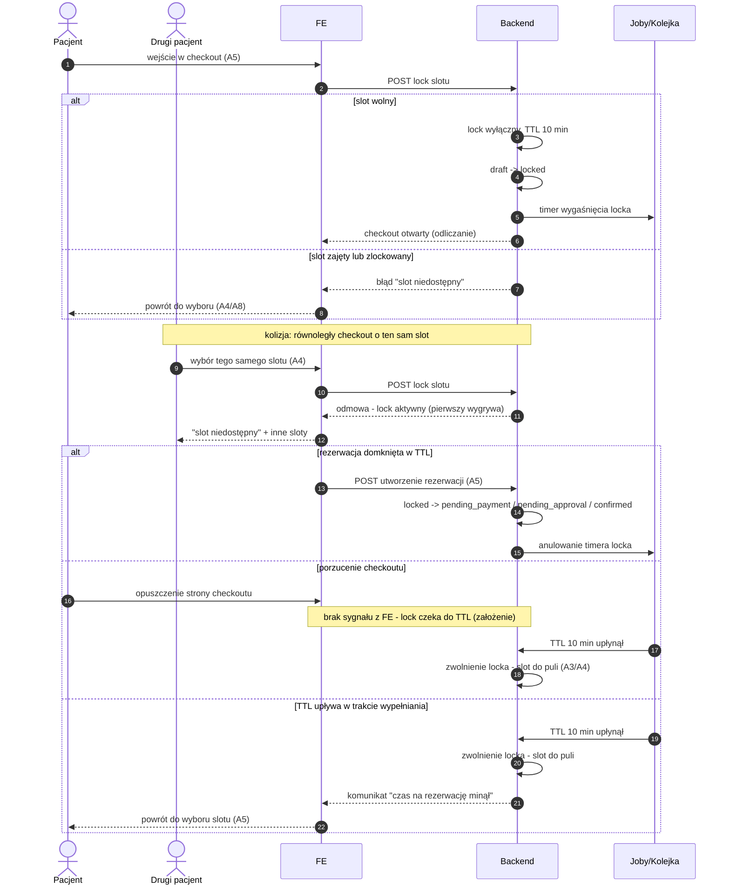

# G5 — Slot lock (TTL 10 min)

## Notatki
- Lock TTL 10 min od wejścia w checkout (A5); stany kanoniczne: `draft → locked`, dalej `pending_payment | pending_approval | confirmed` wg scoring gate G7 (CORE-STANY).
- **Kolizja równoległych checkoutów:** lock jest wyłączny — pierwszy pacjent wygrywa, drugi dostaje "slot niedostępny" i powrót do A4/A8; UX odmowy mapa nie rozstrzyga (założenie minimalne: komunikat + propozycja innych slotów).
- **Porzucenie checkoutu:** brak jawnego sygnału "release" z FE — lock zwalnia się dopiero po TTL (założenie minimalne; mapa mówi "zwolnienie po TTL/porzuceniu" bez rozstrzygnięcia mechanizmu).
- Wygaśnięcie locka NIE emituje `slot.released` — waitlista G6 dotyczy slotów z odwołanych rezerwacji, a lock nigdy nie zdjął slotu z puli publicznej na stałe (założenie).
- TTL w trakcie wypełniania formularza → komunikat "czas minął" + powrót do wyboru slotu, bez utraty wpisanych danych — jak w [[a5-checkout]].
- Aktor "Drugi pacjent" (P2) — spoza stałej listy aktorów CLAUDE.md; niezbędny, by pokazać kolizję (odnotowane).
- Powiązania: [[a5-checkout]] (A5), [[00-stany-rezerwacji]] (CORE-STANY), [[00-katalog-eventow]] (CORE-EVENTY), A3, A4, A8, G6, G7.
