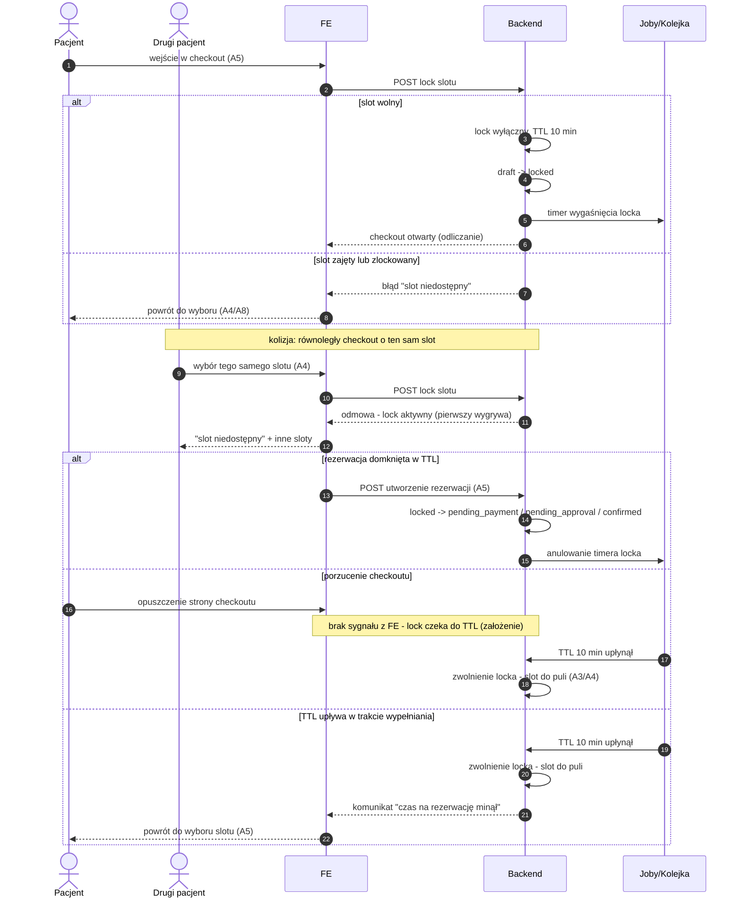

# G5 — Slot lock (TTL 10 min)

## Notatki
- Lock TTL 10 min od wejścia w checkout (A5); stany kanoniczne: `draft → locked`, dalej `pending_payment | pending_approval | confirmed` wg scoring gate G7 (CORE-STANY).
- **Kolizja równoległych checkoutów:** lock jest wyłączny — pierwszy pacjent wygrywa, drugi dostaje "slot niedostępny" i powrót do A4/A8; UX odmowy mapa nie rozstrzyga (założenie minimalne: komunikat + propozycja innych slotów).
- **Porzucenie checkoutu:** brak jawnego sygnału "release" z FE — lock zwalnia się dopiero po TTL (założenie minimalne; mapa mówi "zwolnienie po TTL/porzuceniu" bez rozstrzygnięcia mechanizmu).
- Wygaśnięcie locka NIE emituje `slot.released` — waitlista G6 dotyczy slotów z odwołanych rezerwacji, a lock nigdy nie zdjął slotu z puli publicznej na stałe (założenie).
- TTL w trakcie wypełniania formularza → komunikat "czas minął" + powrót do wyboru slotu, bez utraty wpisanych danych — jak w [[a5-checkout]].
- Aktor "Drugi pacjent" (P2) — spoza stałej listy aktorów CLAUDE.md; niezbędny, by pokazać kolizję (odnotowane).
- Powiązania: [[a5-checkout]] (A5), [[00-stany-rezerwacji]] (CORE-STANY), [[00-katalog-eventow]] (CORE-EVENTY), A3, A4, A8, G6, G7.

## Co opisuje ten diagram

Diagram pokazuje mechanizm chwilowej blokady terminu (lock) na czas wypełniania rezerwacji. Gdy pacjent wchodzi w checkout, system blokuje wybrany slot na 10 minut, żeby nikt inny nie zarezerwował go w tym samym czasie — drugi pacjent próbujący wybrać ten sam termin dostaje komunikat o niedostępności. Uczestniczą pacjent (oraz ewentualny drugi, konkurujący pacjent) i system. Flow kończy się utworzeniem rezerwacji albo automatycznym zwolnieniem terminu z powrotem do puli, gdy czas minie lub pacjent porzuci checkout.

## Powiązane diagramy

| ID | Diagram | Jak się łączy |
|---|---|---|
| A5 | [a5-checkout.md](../a-pacjent-public/a5-checkout.md) | lock zakładany jest przy wejściu w checkout i tam pacjent domyka rezerwację |
| A4 | [a4-profil-specjalisty.md](../a-pacjent-public/a4-profil-specjalisty.md) | wybór slotu zaczyna się na profilu specjalisty; tam wraca pacjent po odmowie |
| A3 | [a3-lista-wynikow.md](../a-pacjent-public/a3-lista-wynikow.md) | zwolniony slot wraca do puli widocznej na liście wyników |
| A8 | [a8-brak-slotow.md](../a-pacjent-public/a8-brak-slotow.md) | gdy slot niedostępny, pacjent może trafić na ścieżkę "brak slotów" |
| G6 | [g6-waitlist-engine.md](g6-waitlist-engine.md) | rozgraniczenie: wygaśnięcie locka nie uruchamia waitlisty (brak `slot.released`) |
| G7 | [g7-scoring-engine.md](g7-scoring-engine.md) | scoring gate decyduje, w jaki stan przechodzi rezerwacja po locku |
| CORE-STANY | [00-stany-rezerwacji.md](../00-core/00-stany-rezerwacji.md) | stany `draft → locked → pending_payment / pending_approval / confirmed` pochodzą stąd |
| CORE-EVENTY | [00-katalog-eventow.md](../00-core/00-katalog-eventow.md) | kontekst eventu `slot.released` i pozostałych silników G |

## Słownik

| Pojęcie | Wyjaśnienie |
|---|---|
| Slot | Pojedynczy wolny termin wizyty w kalendarzu specjalisty. |
| Lock | Tymczasowa, wyłączna blokada slotu dla jednego pacjenta na czas wypełniania rezerwacji. |
| TTL | "Czas życia" blokady — tu 10 minut, po których lock wygasa automatycznie. |
| Checkout | Proces domykania rezerwacji: formularz danych pacjenta i ewentualna płatność (A5). |
| Kolizja | Sytuacja, gdy dwóch pacjentów jednocześnie próbuje zarezerwować ten sam slot — wygrywa pierwszy. |
| `draft` → `locked` | Przejście rezerwacji ze stanu roboczego do stanu z zablokowanym terminem. |
| `pending_payment` / `pending_approval` | Stany po locku: rezerwacja czeka na płatność albo na akceptację specjalisty. |
| Timer | Zadanie w tle odliczające czas do wygaśnięcia locka. |
| Pula slotów | Wszystkie wolne terminy widoczne publicznie w wyszukiwarce i na profilu specjalisty. |
| Scoring gate | Dodatkowy warunek z silnika G7, który pacjentom z historią no-show wymusza przedpłatę lub akceptację. |
