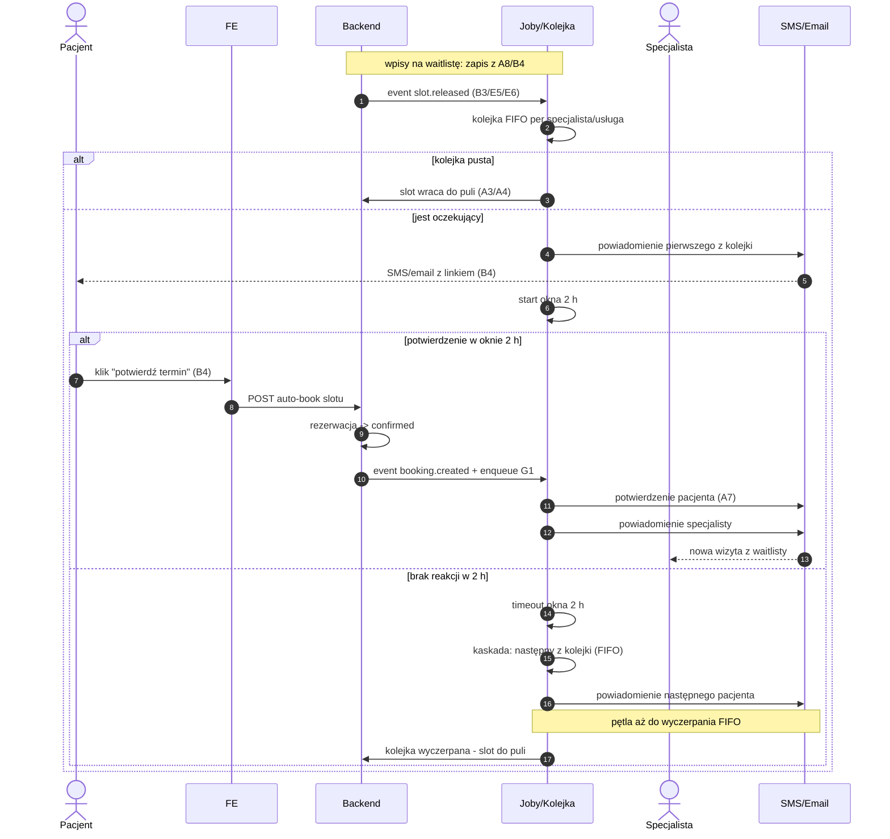

# G6 — Waitlist engine (FIFO, okno 2 h)

## Notatki
- Wejścia silnika: zapis na waitlistę z A8 ("powiadom mnie, gdy zwolni się termin") i B4; zwolnienie slotu: B3 (odwołanie pacjenta), E5/E6 (odwołanie specjalisty), odrzucenie/timeout `pending_approval` ([[a5-checkout-wariant-akceptacja]]), timeout płatności ([[a5-checkout-wariant-przedplata]]).
- FIFO per specjalista/usługa — założenie minimalne (jak w [[b4-waitlista]]); mapa mówi tylko "FIFO".
- Okno 2 h "potwierdź/auto-book": potwierdzenie tworzy rezerwację automatycznie, od razu `confirmed`, bez pełnego checkoutu A5 — założenie minimalne (jak w B4); pominięcie płatności i scoring gate przy auto-booku to otwarta kwestia (⚠️ Flaga 2 pośrednio).
- Brak reakcji w 2 h → kaskada do następnego z kolejki; kolejka wyczerpana → slot wraca do publicznej dostępności (A3/A4) — założenie minimalne.
- Rezygnacja pacjenta z wpisu nieopisana w mapie — założenie: natychmiastowa kaskada do następnego (jak w B4).
- `slot.released` — nazwa robocza eventu (CORE-EVENTY).
- Powiązania: [[b4-waitlista]] (B4), [[00-katalog-eventow]] (CORE-EVENTY), A8, B3, E5, E6, G1, A7, ścieżka e2e "Pacjent zmienia termin".
