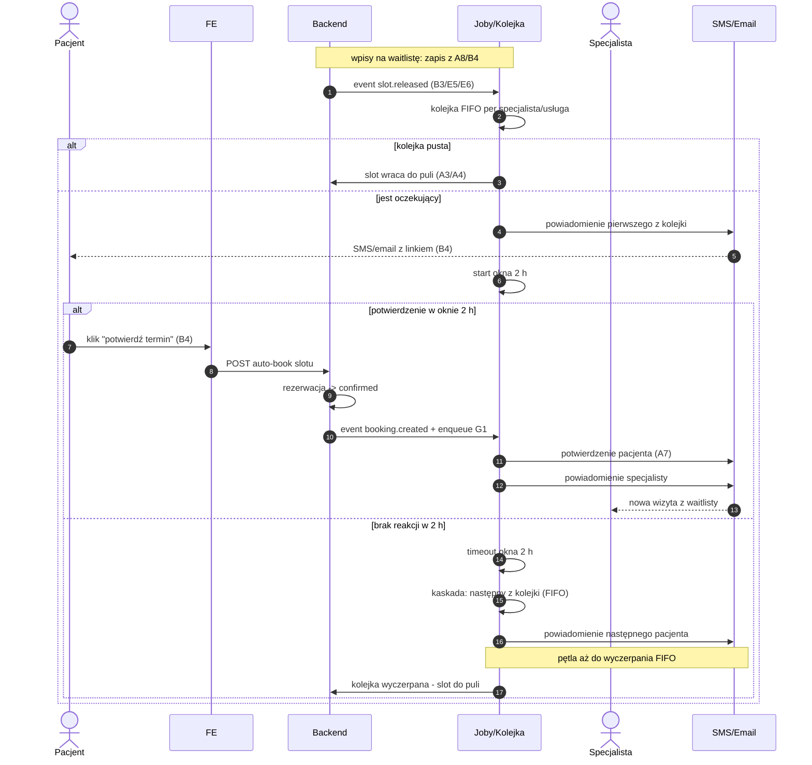

# G6 — Waitlist engine (FIFO, okno 2 h)

## Notatki
- Wejścia silnika: zapis na waitlistę z A8 ("powiadom mnie, gdy zwolni się termin") i B4; zwolnienie slotu: B3 (odwołanie pacjenta), E5/E6 (odwołanie specjalisty), odrzucenie/timeout `pending_approval` ([[a5-checkout-wariant-akceptacja]]), timeout płatności ([[a5-checkout-wariant-przedplata]]).
- FIFO per specjalista/usługa — założenie minimalne (jak w [[b4-waitlista]]); mapa mówi tylko "FIFO".
- Okno 2 h "potwierdź/auto-book": potwierdzenie tworzy rezerwację automatycznie, od razu `confirmed`, bez pełnego checkoutu A5 — założenie minimalne (jak w B4); pominięcie płatności i scoring gate przy auto-booku to otwarta kwestia (⚠️ Flaga 2 pośrednio).
- Brak reakcji w 2 h → kaskada do następnego z kolejki; kolejka wyczerpana → slot wraca do publicznej dostępności (A3/A4) — założenie minimalne.
- Rezygnacja pacjenta z wpisu nieopisana w mapie — założenie: natychmiastowa kaskada do następnego (jak w B4).
- `slot.released` — nazwa robocza eventu (CORE-EVENTY).
- Powiązania: [[b4-waitlista]] (B4), [[00-katalog-eventow]] (CORE-EVENTY), A8, B3, E5, E6, G1, A7, ścieżka e2e "Pacjent zmienia termin".

## Co opisuje ten diagram

Diagram opisuje silnik listy oczekujących: co robi system, gdy zwolni się termin, na który ktoś czekał. Pacjenci zapisują się na waitlistę, gdy brakuje wolnych slotów; kiedy jakiś slot się zwalnia (np. przez odwołanie wizyty), system powiadamia SMS-em lub e-mailem pierwszą osobę z kolejki i daje jej 2 godziny na potwierdzenie. Uczestniczą pacjent, specjalista (dostaje informację o nowej wizycie) oraz system działający w tle. Flow kończy się automatyczną rezerwacją dla pacjenta z kolejki albo — gdy nikt nie zareaguje — powrotem terminu do publicznej puli.

## Powiązane diagramy

| ID | Diagram | Jak się łączy |
|---|---|---|
| B4 | [b4-waitlista.md](../b-pacjent-konto/b4-waitlista.md) | widok pacjenta: zapis na waitlistę i potwierdzanie terminu z linku |
| A8 | [a8-brak-slotow.md](../a-pacjent-public/a8-brak-slotow.md) | drugie wejście silnika — zapis na waitlistę przy braku wolnych terminów |
| B3 | [b3-odwolanie-tokenem.md](../b-pacjent-konto/b3-odwolanie-tokenem.md) | odwołanie wizyty przez pacjenta zwalnia slot (event `slot.released`) |
| E5 | [e5-odwolanie-pojedyncze.md](../e-panel/e5-odwolanie-pojedyncze.md) | odwołanie pojedynczej wizyty przez specjalistę zwalnia slot |
| E6 | [e6-tryb-urlop.md](../e-panel/e6-tryb-urlop.md) | tryb urlop/choroba specjalisty zwalnia sloty hurtowo |
| A5 | [a5-checkout.md](../a-pacjent-public/a5-checkout.md) | auto-book z waitlisty pomija pełny checkout — rezerwacja od razu `confirmed` |
| A5 | [a5-checkout-wariant-akceptacja.md](../a-pacjent-public/a5-checkout-wariant-akceptacja.md) | odrzucenie lub timeout akceptacji specjalisty także zwalnia slot |
| A5 | [a5-checkout-wariant-przedplata.md](../a-pacjent-public/a5-checkout-wariant-przedplata.md) | timeout płatności w wariancie przedpłaty także zwalnia slot |
| A7 | [a7-potwierdzenie.md](../a-pacjent-public/a7-potwierdzenie.md) | pacjent z waitlisty dostaje takie samo potwierdzenie rezerwacji |
| A3 | [a3-lista-wynikow.md](../a-pacjent-public/a3-lista-wynikow.md) | po wyczerpaniu kolejki slot wraca na publiczną listę wyników |
| A4 | [a4-profil-specjalisty.md](../a-pacjent-public/a4-profil-specjalisty.md) | zwolniony slot staje się znów widoczny na profilu specjalisty |
| G1 | [00-katalog-eventow.md](../00-core/00-katalog-eventow.md) | powiadomienia SMS/e-mail wysyła notification engine |
| CORE-EVENTY | [00-katalog-eventow.md](../00-core/00-katalog-eventow.md) | eventy `slot.released` i `booking.created` figurują w katalogu eventów |
| E2E-2 | [e2e-2-zmiana-terminu.md](../e2e/e2e-2-zmiana-terminu.md) | waitlista jest ogniwem ścieżki e2e "Pacjent zmienia termin" |

## Słownik

| Pojęcie | Wyjaśnienie |
|---|---|
| Waitlista | Lista oczekujących pacjentów, którzy chcą dostać powiadomienie, gdy zwolni się termin. |
| FIFO | Kolejność obsługi "kto pierwszy się zapisał, ten pierwszy dostaje propozycję" (first in, first out). |
| Okno 2 h | Czas, jaki powiadomiony pacjent ma na potwierdzenie terminu, zanim propozycja przejdzie dalej. |
| Kaskada | Automatyczne przechodzenie propozycji do kolejnej osoby z kolejki, gdy poprzednia nie zareaguje. |
| Auto-book | Rezerwacja tworzona automatycznie po kliknięciu "potwierdź termin", bez przechodzenia pełnego checkoutu. |
| Slot | Pojedynczy wolny termin wizyty w kalendarzu specjalisty. |
| Event `slot.released` | Komunikat systemowy "zwolnił się termin", który uruchamia ten silnik. |
| Event `booking.created` | Komunikat systemowy "powstała nowa rezerwacja", uruchamiający m.in. powiadomienia. |
| Timeout | Upłynięcie limitu czasu (tu: okna 2 h) bez reakcji pacjenta. |
| Pula publiczna | Wolne terminy widoczne dla wszystkich w wyszukiwarce i na profilu specjalisty. |
| Flaga 2 | Otwarta decyzja projektowa o wariancie checkoutu (przedpłata vs akceptacja), pośrednio dotycząca auto-booku. |
