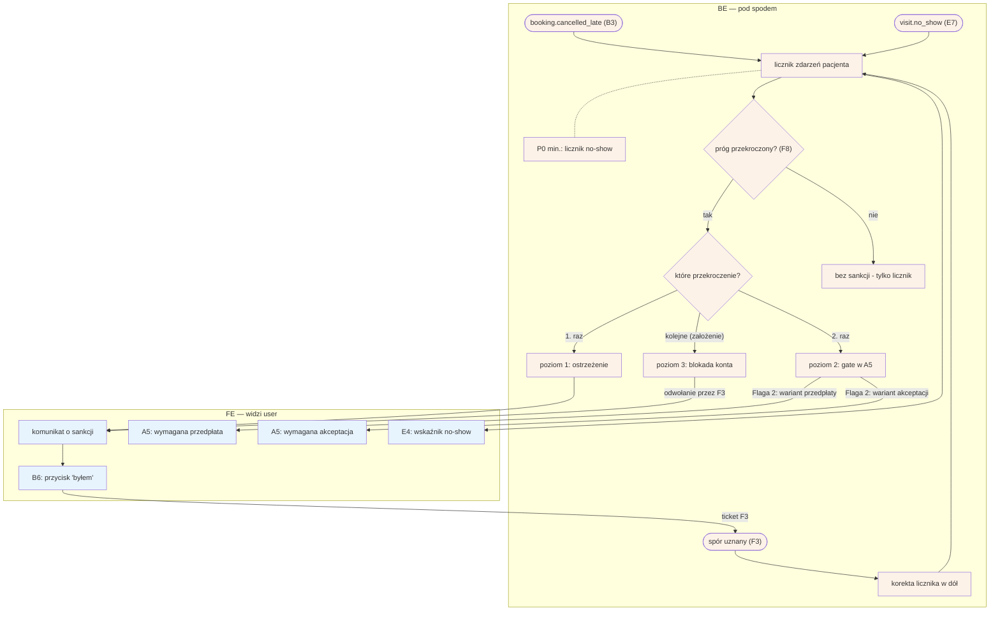

# G7 — Scoring engine (event-driven)

## Notatki
- Event-driven: wejścia `booking.cancelled_late` (B3) i `visit.no_show` (E7) — nazwy kanoniczne z CLAUDE.md.
- **P0 min. = licznik no-show** (mapa G7: "P0 min. → P1 pełny"); pełne progi i sankcje progresywne — P1.
- Progi scoringu konfigurowane per fork — parametry w F8.
- **Sankcje progresywne:** mapa rozstrzyga wprost tylko "2. raz: gate przedpłaty w A5" (ścieżka e2e "No-show + sankcja + spór"); poziom 1 (ostrzeżenie) i poziom 3 (blokada konta, odwołanie przez F3 "odwołania od blokad") — założenia minimalne, zgłoszone w rozbieżnościach.
- **⚠️ Flaga 2 (OTWARTA, decyzja z 2026-07-15 — oba warianty):** gate w checkout A5 = wymagana przedpłata ([[a5-checkout-wariant-przedplata]]) LUB wymagana akceptacja specjalisty ([[a5-checkout-wariant-akceptacja]]); bez płatności online w POC działa wyłącznie wariant akceptacji.
- Spór uznany (F3, stan `disputed → completed`) → korekta licznika w dół / cofnięcie sankcji — założenie minimalne (mapa nie rozstrzyga wprost).
- Wskaźnik no-show pacjenta w E4 (szczegóły rezerwacji u specjalisty) zasilany bezpośrednio licznikiem — widoczny niezależnie od progów.
- Komunikat o sankcji zawiera przycisk "byłem/byłam" (B6) → ticket F3 — pętla korekty na diagramie.
- Powiązania: [[00-katalog-eventow]] (CORE-EVENTY), [[b3-odwolanie-tokenem]] (B3), B6, E4, E7, F3, F8, G8, [[a5-checkout]] (A5), [[g4-auto-approval]].

## Co opisuje ten diagram

Diagram pokazuje silnik scoringu — mechanizm, który w tle zlicza "przewinienia" pacjenta: nieodbyte wizyty (no-show) i zbyt późne odwołania. Uruchamiają go zdarzenia z innych flow (późne odwołanie, oznaczenie no-show, rozstrzygnięcie sporu), a po przekroczeniu progów system nakłada rosnące sankcje: od ostrzeżenia, przez wymóg przedpłaty lub akceptacji przy kolejnej rezerwacji, po blokadę konta. Uczestniczą pacjent (odczuwa sankcje i może się od nich odwołać), specjalista (widzi wskaźnik no-show pacjenta) oraz admin (rozstrzyga spory i odwołania). Silnik działa w sposób ciągły — licznik rośnie i maleje wraz z kolejnymi zdarzeniami, więc flow nie ma jednego punktu końcowego.

## Powiązane diagramy

| ID | Diagram | Jak się łączy |
|---|---|---|
| CORE-EVENTY | [00-katalog-eventow.md](../00-core/00-katalog-eventow.md) | eventy wejściowe `booking.cancelled_late` i `visit.no_show` pochodzą z katalogu |
| B3 | [b3-odwolanie-tokenem.md](../b-pacjent-konto/b3-odwolanie-tokenem.md) | zbyt późne odwołanie wizyty emituje `booking.cancelled_late` |
| E7 | [e7-no-show.md](../e-panel/e7-no-show.md) | oznaczenie no-show przez specjalistę emituje `visit.no_show` |
| B6 | [b6-spor-no-show.md](../b-pacjent-konto/b6-spor-no-show.md) | przycisk "byłem/byłam" pozwala pacjentowi zakwestionować no-show i otworzyć spór |
| F3 | [f3-spory.md](../f-backoffice/f3-spory.md) | uznany spór koryguje licznik w dół; tu też odwołania od blokady konta |
| F8 | [f8-konfiguracja-forka.md](../f-backoffice/f8-konfiguracja-forka.md) | progi scoringu są konfigurowane per fork w ustawieniach platformy |
| E4 | [e4-rezerwacje.md](../e-panel/e4-rezerwacje.md) | wskaźnik no-show pacjenta widoczny u specjalisty przy rezerwacji |
| A5 | [a5-checkout.md](../a-pacjent-public/a5-checkout.md) | gate poziomu 2 działa w checkoucie rezerwacji |
| A5 | [a5-checkout-wariant-przedplata.md](../a-pacjent-public/a5-checkout-wariant-przedplata.md) | wariant sankcji poziomu 2: wymagana przedpłata (Flaga 2) |
| A5 | [a5-checkout-wariant-akceptacja.md](../a-pacjent-public/a5-checkout-wariant-akceptacja.md) | wariant sankcji poziomu 2: wymagana akceptacja specjalisty (Flaga 2) |
| G4 | [g4-auto-approval.md](g4-auto-approval.md) | auto-approval jest blokowany dla wizyt `no_show`/`disputed`, których wynik zasila scoring |
| G8 | [00-katalog-eventow.md](../00-core/00-katalog-eventow.md) | fraud detection to pokrewny silnik anty-nadużyciowy z katalogu eventów |

## Słownik

| Pojęcie | Wyjaśnienie |
|---|---|
| Scoring | Zliczanie zachowań pacjenta (no-show, późne odwołania), na podstawie którego system nakłada sankcje. |
| Event-driven | Sposób działania silnika: reaguje na zdarzenia (eventy) z innych części systemu, a nie na harmonogram. |
| Event `booking.cancelled_late` | Komunikat systemowy o odwołaniu wizyty zbyt późno przed terminem. |
| Event `visit.no_show` | Komunikat systemowy, że pacjent nie stawił się na wizycie. |
| Licznik | Suma zdarzeń no-show i późnych odwołań przypisana do konkretnego pacjenta. |
| Próg | Wartość licznika, po której przekroczeniu włącza się sankcja; konfigurowany w F8. |
| Sankcje progresywne | Kary rosnące z każdym przekroczeniem progu: ostrzeżenie → gate w checkoucie → blokada konta. |
| Gate (w A5) | Dodatkowa bariera przy rezerwacji: wymagana przedpłata albo akceptacja specjalisty. |
| Przedpłata | Płatność z góry wymagana od pacjenta z historią no-show. |
| Korekta licznika | Obniżenie licznika (i ewentualne cofnięcie sankcji) po uznaniu sporu pacjenta w F3. |
| Fork | Osobna kopia platformy dla innego wertykału lub rynku, z własną konfiguracją progów. |
| Flaga 2 | Otwarta decyzja projektowa: gate to przedpłata czy akceptacja specjalisty (obecnie oba warianty). |
